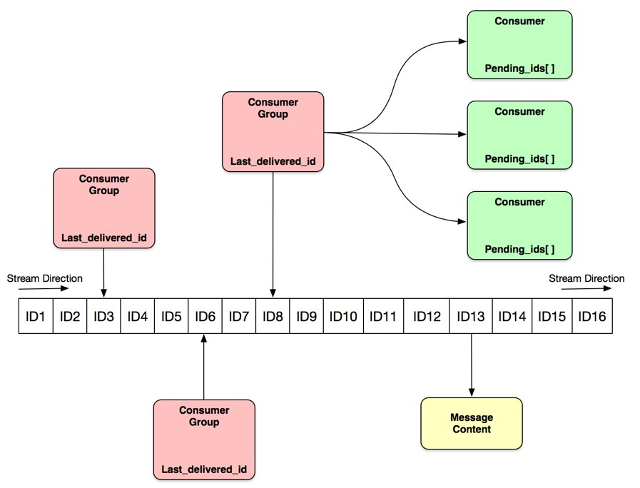
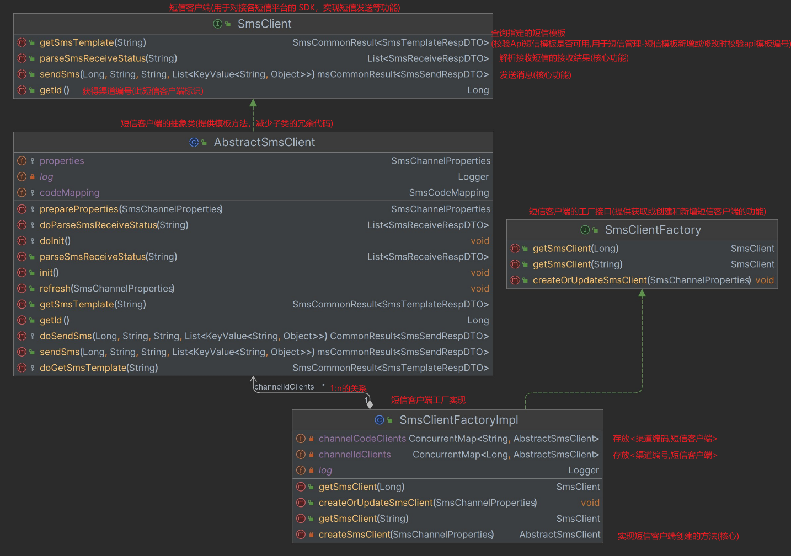
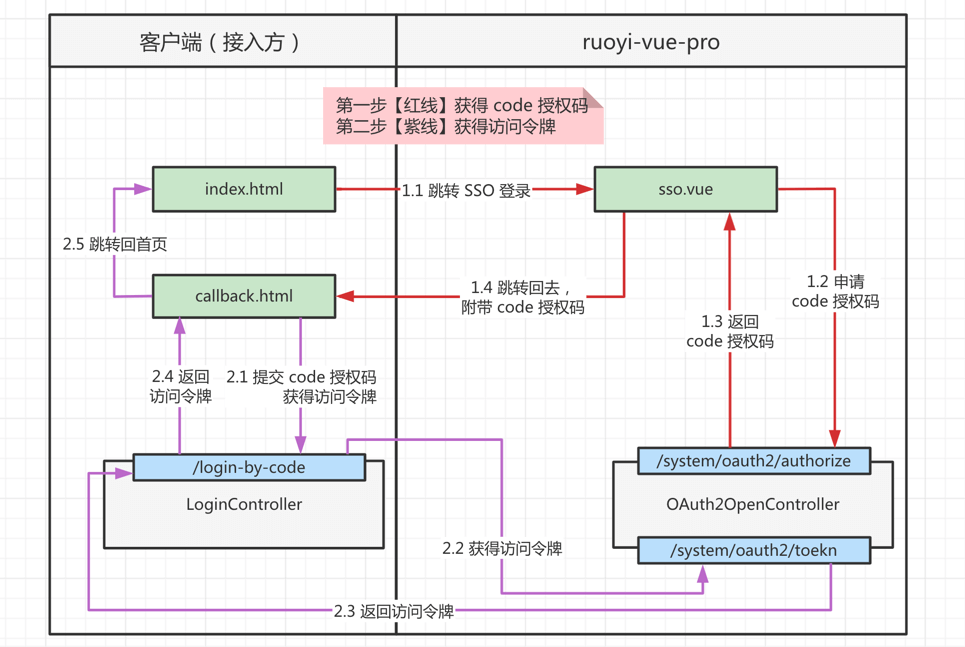
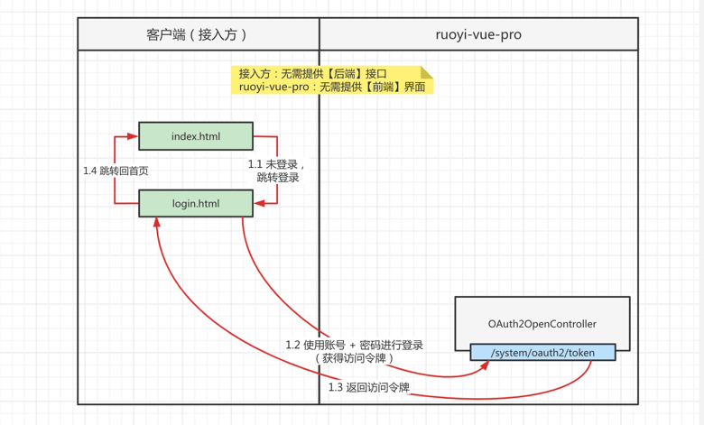

### 提交大纲
#### 创建一个架子，并调通接口
1. [yudao-server]

   1. 空壳项目，作为启动使用。其他业务模块会作为依赖引入，进行整合。
   2. 调通接口

2. [yudao-dependencies]

    1. 基础 bom 文件，管理整个项目的依赖版本
    2. 管理springboot版本为2.7.13

3. [最外层pom.xml]
	1. 作为其他所有模块的父pom，管理项目的版本号和依赖
	2. 版本仲裁(`<dependencyManagement>`)中import[yudao-dependencies]，将[yudao-dependencies]的依赖管理传递给所有的子模块，进而统一管理所有模块的依赖版本
    -  `<scope>import</scope>`只能在`<dependencyManagement>`中使用，只会将被引用依赖中`<dependencyManagement>`中的依赖关系导入下来
#### 创建组件架子
1. [yudao-framework]
	1. 创建一个[yudao-framework]作为所有组件的父项目，管理子项目的依赖关系和构建配置。
		- <packaging>pom</packaging>表示该模块仅作为依赖项，不作为jar包。一般作为父项目，管理子项目的依赖关系和构建配置。

	2. 该包是技术组件，每个子包，代表一个组件。
2. [yudao-spring-boot-starter-web]
	1. 创建一个web组件空架子。用于未来实现或封装Web 框架，全局异常、API 日志等
	2. 引入spring-boot-starter-web依赖，web相关依赖会全放在这。
		- org.springframework.boot.autoconfigure.AutoConfiguration.imports 用于导入其他自动配置类（不写则不导入）。
		- YudaoWebAutoConfiguration 针对 SpringMVC 的基础封的配置类，用于自动配置针对 SpringMVC 的基础封装的各种组件和功能的类。
3. [yudao-dependencies]
	1. 对yudao-spring-boot-starter-web进行版本管理
4. [yudao-server]
	1. 移除spring-boot-starter-web依赖，使用组件[yudao-spring-boot-starter-web]提供的web功能

#### 创建banner组件和通用类、工具类jar依赖
1. [yudao-common]
   1. jar包模块，定义基础的通用类，和框架无关，所有的组件都会引用它
   2. 引入lombok和hutool 
2. [yudao-spring-boot-starter-banner]
   1. 简单的用于打banner的组件
   2. banner.txt，自定义的banner
   3. BannerApplicationRunner，在项目启动后执行日志打印，补充banner信息
   		- ApplicationRunner，Spring Boot提供的接口，在项目启动后执行run方法
3. lombok.config
   1. lombok.config是lombok的配置文件，用于配置此文件所在目录以及子目录的lombok特性，子目录中配置文件可以覆盖父目录配置


#### 创建系统管理业务模块架子[yudao-module-system]

1. [yudao-module-system]
   1. 存放管理后台系统管理相关业务，用户、部门、权限、数据字典等等
   2. 作为system模块的父pom
2. [yudao-module-system-api]
   1. system 模块 API，暴露给其它模块调用，暴露的接口由[yudao-module-system-biz]实现
3. [yudao-module-system-biz]
   1. system 模块的具体实现


#### 给管理后台和app端接口路径增加访问前缀

1. [yudao-spring-boot-starter-web]

   1. 给接口路径增加访问前缀，避免接口路径暴露（不理解）
      1. 给`**.controller.admin.**`下的接口路径增加访问前缀/admin-api
      2. 给`**.controller.app.**`下的接口路径增加访问前缀/app-api

   - WebMvcConfigurer
     - WebMvcConfigurer是一个接口，里面提供了很多web应用常用的拦截方法。通过实现该接口，可以实现web应用 跨域设置、类型转化器、自定义拦截器、页面跳转等功能。
   - configurePathMatch：路径匹配规则
     - 设置前端请求url与后端接口url的匹配规则。


#### 基于 Swagger + Knife4j 实现 API 接口文档

1. [yudao-spring-boot-starter-web]

   1. 生成接口文档，支持接口调试。地址：http://localhost:48080/doc.html#/home
   2. 编写swagger包，集成 Swagger + Knife4j 实现 API 接口文档
   3. 配置OpenAPI页面的接口信息

   - @ConditionalOnProperty：用于根据配置文件中的属性值来决定是否加载某个Bean或配置类。
     - @ConditionalOnProperty注解有以下几个常用的属性：
       - name：指定配置文件中的属性名。
       - havingValue：指定配置文件中的属性值，与name属性一起使用。
       - matchIfMissing：当配置文件中没有指定属性时，是否加载被注解的Bean或配置类。
       - prefix：指定配置文件中的属性名的前缀。
       - value：name属性的别名。
   - spring-boot-configuration-processor：用于生成配置元数据的注解处理器，使用后在配置文件（yml等）中写配置会有提示（不知道为什么没生效）
   - maven中`<optional>true</optional>`：true是用来标记一个依赖项为可选的。当一个依赖项被标记为可选时，它不会被自动包含在项目的依赖树中，也不会传递给其他依赖项。
   - Springdoc：Springdoc是一个用于生成OpenAPI（前身为swagger）文档的Spring Boot库。它通过解析应用程序中的注解和配置，自动生成API文档，并提供了一些自定义选项和扩展功能。与Swagger UI集成，可以方便地查看和测试API文档。
   - Knife4j：基于Springdoc的一个增强工具
   - knife4j-openapi3-spring-boot-starter：集成和使用Knife4j，一个用于生成和展示OpenAPI文档的工具。集成了springdoc-openapi-ui、
   - springdoc-openapi-ui：用于生成和展示OpenAPI文档的开源库，自动将你的API端点映射为OpenAPI规范（[yudao-server]中的TestController）


#### 数据校验

1. [yudao-server]

   1. 对接口入参进行数据校验

   - [spring-boot-starter-validation]：提供了对数据校验的支持。它基于Java Bean Validation规范（JSR 380）实现，可以用于对请求参数、方法参数、实体对象等进行校验。


#### 设置通用接口结果返回和异常统一处理

1. [yudao-common]
   1. 设置通用结果类CommonResult
   2. 设置异常体系
      1. ErrorCode：异常码
      2. ServiceException：业务异常
      3. ServerException：服务异常
      4. GlobalErrorCodeConstants：全局错误码枚举
      5. ServiceErrorCodeRange：业务异常的错误码区间规定
      6. ServiceExceptionUtil：业务异常工具类，便于手动抛业务异常和格式化异常信息
2. [yudao-spring-boot-starter-web]
   1. GlobalExceptionHandler：全局异常处理
3. [yudao-module-system-biz]
   1. TestController测试上述功能

#### 接入验证码和redis

1. [yudao-spring-boot-starter-redis]

   1. 创建RedisTemplate<String, Object> Bean，使用 JSON 序列化方式，支持任何对象类型的序列化/反序列化

   - JavaTimeModule：支持Java 8中的日期和时间类型的序列化和反序列化。
   - redisson：Java的分布式对象存储和缓存框架，目前仅使用到它创建RedisConnectionFactory bean，连接redis的功能

2. [yudao-spring-boot-starter-captcha]

   1. 基于 aj-captcha 实现滑块验证码

   - RedisCaptchaServiceImpl：基于SPI实现验证码缓存的set和get（redis实现）

3. [yudao-module-system-biz]

   1. 实现业务接口，验证码的获取和校验

   - @CrossOrigin：解决跨域

#### 自定义banner、开启验证码限流、全局跨域配置

1. [yudao-spring-boot-starter-banner]

   1. 自定义banner文件：MyBanner.txt

2. [yudao-spring-boot-starter-captcha]

   1. 开启一分钟内接口请求次数限制配置：req-frequency-limit-enable=true

   - CaptchaVO#browserInfo：客户端ip+userAgent，用于生成clientUid（限流开启时使用）
   - FrequencyLimitHandler：频率限制处理程序，按clientUid进行限流。（实现时使用clientUid作为缓存key，进行加锁和计数）

3. [yudao-spring-boot-starter-web]

   1. 创建CorsFilter Bean，解决跨域

   - FilterRegistrationBean：用于注册和管理过滤器（Filter）的Bean。管理生命周期或者设置过滤器的名称、URL模式、调用顺序等
   - CorsFilter：跨域filter
   - UrlBasedCorsConfigurationSource：为不同的URL路径配置不同的CORS策略（CorsConfiguration）。
   - CorsConfiguration：CORS配置

#### 集成mybatis和多数据源

1. [yudao-spring-boot-starter-mybatis]

   1. 整合mybatisplus
      1. 依赖mybatis-plus-boot-starter
      2. 开启下划线（数据库字段）转驼峰（DO字段）映射：map-underscore-to-camel-case: true
      3. 配置全局主键生成策略：id-type: AUTO（自增）
      4. 配置逻辑删除/未删除的值：logic-delete-value/logic-not-delete-value
      5. 数据库敏感数据加密密码配置：mybatis-plus.encryptor.password（应该没用到）
   2. MybatisPlus的注解
      1. @TableName：DO对应的表名，不写则取DO类名
         1. 属性autoResultMap：autoResultMap配置为true时，MyBatis会自动根据查询结果的列名和Java对象的属性名进行映射，创建结果映射。无需手动编写结果映射。
      2. @TableLogic：标注为逻辑删除字段.
   3. MybatisPlus的API
      1. BaseMapper类：Mapper 继承该接口后，无需编写 mapper.xml 文件，即可获得CRUD功能
      2. LambdaQueryWrapper：Lambda 语法使用 Wrapper（Wrapper为查询条件封装，eq、like等等）
   4. 开启多数据源支持
      1. 依赖dynamic-datasource-spring-boot-starter
   5. 配置druid数据源
      1. 依赖druid-spring-boot-starter
   6. 开启事务支持
      1. @EnableTransactionManagement
   7. 扫描mapper接口，注册映射器
   8. 配置mybatisPlus拦截器，开启分页

   - 扫描cn.iocoder.yudao包下的并且由@Mapper注解标记的接口,注册为MyBatis的映射器。lazyInitialization=true则开启延迟加载Mapper接口的实现类

     ```
     @MapperScan(value = "cn.iocoder.yudao", annotationClass = Mapper.class,
             lazyInitialization = "${mybatis.lazy-initialization:false}")
     ```

2. [yudao-module-system-biz]
   1. 编写业务接口：**/system/tenant/get-id-by-name**(使用租户名，获得租户编号)
   2. 创建TenantController、TenantService、TenantMapper


#### 使用账号密码登录

1. [yudao-module-system-biz]

   1. 实现/login接口
      1. 校验验证码
         - 服务端验证码二次校验：（猜测）验证码check接口和login接口非同一接口。为防止用户直接跳过验证码的check接口，因此会在login接口进行二次验证码校验，校验check接口下发的验证成功的票据
      2. 认证账号密码
         - 密码校验未做
      3. 下发token

2. [yudao-common]

   1. 创建ValidationUtils，提供方法内的参数校验

   - Validator：基于JSR-303标准的参数校验类
     - validate方法：执行校验操作，返回验证失败的约束
   - ConstraintViolation：验证失败的约束

#### 集成mapstruct（对象转换工具）

1. [yudao-common]

   1. 集成mapstruct的依赖，便于所有模块使用
      - mapstruct
        - Java注解处理器
        - 基于JSR 269实现，在编译期处理注解，并且读取、修改和添加抽象语法树中的内容（https://blog.csdn.net/Mango_Bin/article/details/125168370）
        - 在编译期自动生成映射转换代码，因此安全性高，速度快。

2. [yudao-module-system-biz]

   1. 创建/list-all-simple，获得全部字典数据列表接口

   - cn.iocoder.yudao.module.system.convert：存放mapstruct的对象转换类


#### RBAC权限-获取登录用户的权限信息（待完善）

1. [yudao-module-system-biz]
   1. 创建接口/get-permission-info：获取登录用户的权限信息
      - RBAC模式，通过登录用户获取用户角色信息，通过角色获取角色菜单信息
   2. 获取权限信息后，可以进入到后台页面了

#### 整合spring-security，完善登录认证

1. [yudao-spring-boot-starter-security]

   1. 自定义Filter（` TokenAuthenticationFilter`）完成token解析和用户认证

      1. 解析自定义header(头Authorization)获取token
      2. 解析token，构建用户信息
      3. 构建认证信息，完成认证（`cn.iocoder.yudao.framework.security.core.util.SecurityFrameworkUtils#buildAuthentication`）

   2. 配置`SecurityFilterChain`

      1. CSRF禁用
      2. 开放无需认证即可访问的接口，其他接口配置为认证才可访问
      3. 配置`TokenAuthenticationFilter`在`UsernamePasswordAuthenticationFilter`之前

      - @EnableWebSecurity：启用spring security，加载一堆相关的bean
      - SecurityFilterChain：过滤器链，spring security是基于各种过滤器实现的权限控制,`filterChain`方法就是构建各种过滤器
      - csrf：跨站请求伪造，spring security默认开启了csrf，启用后需要前端配合编码，因此关闭
      - authorizeRequests：允许根据使用RequestMatcher实现（即通过 URL 模式）限制HttpServletRequest访问。
      - antMatchers：ant模式的接口路径匹配。
      - .permitAll()：允许任何人访问（无论是否为登录用户）
      - httpSecurity.addFilterBefore：在某过滤器之前添加一个过滤器
      - UsernamePasswordAuthenticationFilter：基于用户名和密码的身份验证过滤器，是spring security默认的认证过滤器

2. [yudao-spring-boot-starter-redis]

   1. 创建RedisUtil，提供redis读写服务

3. [yudao-module-system-biz]

   1. /login接口中，在登录成功后将用户的token存入缓存中，用于` TokenAuthenticationFilter`中进行token的认证和解析，完善登录认证流程

#### 自定义免登录和免鉴权注解

1. [yudao-spring-boot-starter-security]

   1. 自定义免登录免鉴权注解

      1. @LoginFree：免登录
      2. @Authenticated：免鉴权

   2. 解析注解配置相应的权限规则（`YudaoWebSecurityConfigurerAdapter`方法`filterChain`中）

      - @PostConstruct：标记一个方法，在对象创建之后，依赖注入完成之后，自动执行该方法。

      - Multimap：多映射Map，相同的key可以有多个值。guava包提供，形如：

        > A → 1
        > A → 2
        > b → 3

      - `.permitAll()`：允许任何人访问（无论是否为登录用户）

      - `.authenticated()`：指定任何经过身份验证的用户都允许使用 URL

2. [yudao-module-system-biz]

   1. 登录之前的接口方法上使用@LoginFree进行标注，实现免登录

#### 封装数据库公共字段DO

1. [yudao-spring-boot-starter-mybatis]
   1. 抽取数据库公共字段封装成对象`BaseDO`

#### 实现部门管理功能和数据库通用字段自动填充
1. [yudao-spring-boot-starter-mybatis]

   1. `BaseDO`字段上面添加字段自动填充策略
      - fill：自动填充策略
        - DEFAULT：默认不处理
        - INSERT：插入时填充字段
        - UPDATE：更新时填充字段
        - INSERT_UPDATE：插入和更新时填充字段
      - jdbcType：字段对应的数据库类型
   2. 创建数据库通用字段自动填充控制器（见`DefaultDBFieldHandler`）
   3. 配置`MetaObjectHandler`bean

   - MetaObjectHandler：元对象字段填充控制器抽象类，实现公共字段自动写入

   - insertFill：插入时对字段的填充
   - updateFill：更新时对字段的填充
   - MetaObject：操作Java对象的工具类。它提供了一系列方法，可以方便地对Java对象进行属性的读取、写入和判断等操作。(Mybatis提供)

2. [yudao-module-system-biz]

   1. `/get-unread-count`接口暂时写一个空实现，不让页面报错
   
   2. 用户模块提供`/system/user/list-all-simple`接口，获取用户精简信息列表。供部门管理使用
   
   3. 部门管理
      1. 数据库模型
         
      
      2. CRUD
         - `validateForCreateOrUpdate()`方法：
           - 校验自己是否存在
           - 校验父部门的有效性
             - 不能设置自己为父部门
             - 父岗位是否存在校验
             - 父部门不能是原来的子部门（需要递归校验所有子部门）


#### Mybatis组件增强

1. [yudao-spring-boot-starter-mybatis]

   1. `BaseMapperX`：在 MyBatis Plus 的`BaseMapper`的基础上拓展，提供更多的能力，简化dal层代码书写
      1. 增强`selectOne()`

      2. 增强`selectList()`

      3. 提供`insertBatch()`

      4. 提供`updateBatch()`

      5. 提供`saveOrUpdateBatch()`
   2. `LambdaQueryWrapperX`：拓展 MyBatis Plus `QueryWrapper`类
      1. 拼接条件的方法，增加 xxxIfPresent 方法，用于判断值不存在的时候，不要拼接到条件中。
      2. 重写父类方法，方便链式调用

      

#### 岗位管理

1.  [yudao-common]

   1. 分页查询支持

2. [yudao-spring-boot-starter-mybatis]

   1. 分页查询支持

3. [yudao-module-system-biz]

   1. 岗位管理数据库模型

      

   2. CRUD

#### Spring Security 密码编码器

1. [yudao-spring-boot-starter-security]
   1. 配置密码编码器`PasswordEncoder`
2. [yudao-module-system-biz]
   1. 登录接口使用密码编码器验证密码

#### 用户管理

1. [yudao-module-system-biz]
   
	1. 用户管理数据库模型
	    
	
	2. CRUD
	
	    1. 检验用户正确性
	
	       1. 校验用户存在
	       2. 校验用户名唯一
	       3. 校验手机号唯一
	       4. 校验邮箱唯一
	       5. 校验部门处于开启状态
	       6. 校验岗位处于开启状态（所选的多个岗位）
	
	    2. 更新用户岗位
	
	       1. 计算应新增岗位：计算集合的单差集，即只返回【前端页面传递的岗位编号集合】中有，但是【该用户数据库记录中所拥有岗位编号集合】中没有的元素
	       2. 计算应删除岗位：计算集合的单差集，即只返回【该用户数据库记录中所拥有岗位编号集合】中有，但是【前端页面传递的岗位编号集合】中没有的元素
	       3. 执行新增和删除
	
	       - `CollUtil.subtract()`：求单差集
	       - `CollectionUtils.singleton(T o)`：返回仅包含指定对象的不可变集。
	         - o不可变
	         - 同时不可移除该元素。`removeIf`方法会报错。
	         - 这样设计应该是为了防止用户误操作
	
	    3. 用户分页查询-按部门查询时
	
	       1. 递归查询获取到当前部门的所有子部门(子子孙孙部门)
	       2. 按当前部门+所有子部门作为部门条件查询用户列表
	
	    4. 创建用户是密码加密后落库
	
	       1. 使用spring security的`PasswordEncoder`对密码加密后落库
	
	- @DateTimeFormat：用于请求参数（例如控制器方法的参数）上，以指定日期时间格式化规则，以便在请求处理期间将日期时间字符串转换为 Java 对象（）。
	
	  

#### 自定义Bean Validation 和自定义Mybatis Plus的类型处理器（`TypeHandler`）

1. [yudao-common]

   1. 自定义Bean Validation（`@Mobile`同理）

      1. 自定义验证注解`@InEnum`：用于校验参数是否在枚举值范围内

         - `@Constraint`：
           - `@Constraint` 是 Bean Validation 中的注解，用于创建自定义验证注解。
           - `validatedBy` 属性：`validatedBy` 属性是 `@Constraint` 注解的一部分，它接受一个验证器类或验证器类的数组。
           -  Bean Validation 会根据参数字段的类型选择合适的验证器进行验证。

      2. 自定义验证器`InEnumValidator`和`InEnumCollectionValidator`

         1. `InEnumValidator`：验证参数类型为`Integer`的字段的值
         2. `InEnumCollectionValidator`：验证参数类型为`Collection<Integer>>`的字段的值

         - `ConstraintValidator`：
           - 这是 Bean Validation 框架提供的一个接口，用于创建自定义验证器。
           - `initialize`: 在验证器初始化时调用，你可以在这里执行一些初始化操作。
           - `isValid`: 用于实际验证逻辑的方法，它接收被注解的字段或参数的值，并返回一个布尔值，表示验证是否通过。

      3. 辅助验证的接口`IntArrayValuable`

         1. 辅助@InEnum的验证器获取用于校验的枚举的值

      - `@Target` 注解：`@Target` 是一个元注解，用于指定注解的使用范围。
        - `ElementType.METHOD`：可以用于方法。
        - `ElementType.FIELD`：可以用于字段。
        - `ElementType.ANNOTATION_TYPE`：可以用于其他注解。
        - `ElementType.CONSTRUCTOR`：可以用于构造函数。
        - `ElementType.PARAMETER`：可以用于方法参数。
        - `ElementType.TYPE_USE`：可以用于类型使用处，例如在泛型中。
      - `@Retention` 注解：`@Retention` 是另一个元注解，用于指定注解的保留策略。在这里，`@InEnum` 注解的保留策略是 `RetentionPolicy.RUNTIME`，表示这个注解将在运行时保留，以便在运行时可以通过反射获取注解信息。

2. [yudao-spring-boot-starter-mybatis]

   1. 自定义`TypeHandler`

      1. 自定义Mybatis Plus类型处理器`JsonLongSetTypeHandler`：实现数据库字符串字段和 Set 并且泛型为 Long的java对象的自动转换 

      - `AbstractJsonTypeHandler`：是 MyBatis Plus 框架中的一个抽象类，用于处理数据库字段与 Java 中的 JSON 类型之间的转换。
      - `parse()`：json字符串转jaa对象
      - `toJson`：java对象转json字符串

   2. 使用`TypeHandler`

      ```java
          /**
           * 岗位编号数组
           */
          @TableField(typeHandler = JsonLongSetTypeHandler.class)
          private Set<Long> postIds;
      ```


#### 登录过期时自动转到登录页面重新登录

1. 自定义`AuthenticationEntryPoint`类[AuthenticationEntryPointImpl.java](yudao-framework%2Fyudao-spring-boot-starter-security%2Fsrc%2Fmain%2Fjava%2Fcn%2Fiocoder%2Fyudao%2Fframework%2Fsecurity%2Fcore%2Fhandler%2FAuthenticationEntryPointImpl.java)

   1. 用户登录过期后返回错误码401，前端接收响应后自动跳转到登录页

   - `AuthenticationEntryPoint`：即使用户已经登录，但由于某些原因（例如会话过期或凭证失效），仍然无法访问受保护的资源。在这种情况下，`AuthenticationEntryPoint` 也会被触发。

   

#### 角色管理

1. [yudao-module-system-biz]
   1. 角色管理数据库模型
      
   2. CRUD
      1. 超级管理员(用code区分)，不允许创建
      2. 内置角色不允许操作

#### 菜单管理

1. [yudao-module-system-biz]
   1. 菜单数据库模型
      
      
      - 菜单id自关联
      - `permission`：
        - 权限标识：一般格式为：${系统}:${模块}:${操作} 例如说：system:admin:add，即 system 服务的添加管理员。
        - 仅按钮和菜单上需填写。目录不用
        - 用法:
          1. 对后端接口的访问权限控制:
             1. 用户的角色拥有该菜单或按钮就拥有此`permission`对应的 `@PreAuthorize`("@ss.hasPermission('`permission`')")接口访问权限
          2. 对页面按钮的展示控制：
             1. 前端按钮上会标记对应`permission`的值，与用户的权限进行匹配，匹配不上就不展示按钮
                1. 原因：用户的角色未分配该按钮，权限信息中就不会有该`permission`值，按钮就不会展示
      - type：目录、菜单、按钮（目录应该是任何人都能有权限访问，不控制权限）
      - path：路由地址。如果 path 为 http(s) 时，则它是外链
      - 组件地址：用途不明，可能是前端的vue文件，缓存时使用
      - visible：是否可见。只有菜单、目录使用 当设置为 true 时，该菜单不会展示在侧边栏，但是路由还是存在。例如说，一些独立的编辑页面 /edit/1024 等等
      - keepAlive：是否缓存 。只有菜单、目录使用，否使用 Vue 路由的 keep-alive 特性 注意：如果开启缓存，则必须填写 componentName 属性，否则无法缓存
      - alwaysShow：是否总是显示。如果为 false 时，当该菜单只有一个子菜单时，不展示自己，直接展示子菜单
      
   2. CRUD
      1. 校验父菜单存在
      2. 校验菜单（自己）
      3. 父菜单必须是目录或者菜单类型
      4. 存在子菜单，无法删除
      
      - 存在bug：可设置自己的子菜单为父菜单


#### RBAC权限-获取登录用户的权限信息（完善）

1. [yudao-module-system-biz]

   1. RBAC数据库模型
       
      - 基于角色的权限控制。给用户分配角色即分配权限（菜单、按钮、接口等）
      - 特殊角色：角色`code`值为`super_admin`的为超级管理员，拥有所有权限。
   2. 编写登出接口
      - 登出时删除token的redis缓存

#### 租户管理与jackson序列化

1. [yudao-spring-boot-starter-web]
   1. jackson序列化：Java对象和JSON互相转换的过程
      1. [LocalDateTimeDeserializer.java](yudao-framework%2Fyudao-spring-boot-starter-web%2Fsrc%2Fmain%2Fjava%2Fcn%2Fiocoder%2Fyudao%2Fframework%2Fjackson%2Fcore%2Fdatabind%2FLocalDateTimeDeserializer.java)：LocalDateTime反序列化规则，会将毫秒级时间戳反序列化为LocalDateTime
         - `JsonDeserializer<LocalDateTime>`：表示它是一个用于反序列化LocalDateTime对象的自定义反序列化器。
         - `public static final LocalDateTimeDeserializer INSTANCE = new LocalDateTimeDeserializer();`：这是一个静态的常量，表示一个单例的LocalDateTimeDeserializer实例。通常，为了节省资源，自定义反序列化器会以单例模式创建，因此通常会有一个常量来表示该实例。
         - `deserialize()`：覆盖了JsonDeserializer类中的deserialize方法，以提供自定义的反序列化逻辑。
         - `return LocalDateTime.ofInstant(Instant.ofEpochMilli(p.getValueAsLong()), ZoneId.systemDefault());`：这是实际的反序列化逻辑。它执行以下操作：
           - `p.getValueAsLong()`：从JsonParser对象中获取时间戳的值，这个时间戳通常表示为毫秒数。 
           - `Instant.ofEpochMilli(...)`：将毫秒时间戳转换为Instant对象，Instant是Java 8中表示时间戳的类。 
           - `ZoneId.systemDefault()`：获取系统默认的时区。 
           - `LocalDateTime.ofInstant(...)`：将Instant对象转换为LocalDateTime对象，考虑了时区信息，从而将时间戳转换为本地日期和时间。
      2. [LocalDateTimeSerializer.java](yudao-framework%2Fyudao-spring-boot-starter-web%2Fsrc%2Fmain%2Fjava%2Fcn%2Fiocoder%2Fyudao%2Fframework%2Fjackson%2Fcore%2Fdatabind%2FLocalDateTimeSerializer.java)：LocalDateTime序列化规则，会将LocalDateTime序列化为毫秒级时间戳
         - `JsonSerializer<LocalDateTime>`：表示它是一个用于序列化LocalDateTime对象的自定义序列化器。
         - `serialize()`：覆盖了JsonSerializer类中的serialize方法，以提供自定义的序列化逻辑。
         - `public void serialize(LocalDateTime value, JsonGenerator gen, SerializerProvider serializers) throws IOException`：这是serialize方法的定义，用于实际执行序列化操作。它接受三个参数：
           - `value`：要序列化的LocalDateTime对象。
           - `gen`：一个JsonGenerator对象，用于生成JSON数据。
           - `serializers`：一个SerializerProvider对象，提供了序列化过程中的上下文信息。
         - `gen.writeNumber(value.atZone(ZoneId.systemDefault()).toInstant().toEpochMilli());`：这是实际的序列化逻辑。它执行以下操作：
           - `value.atZone(ZoneId.systemDefault())`：将LocalDateTime对象与系统默认的时区（ZoneId.systemDefault()）关联，以便将日期时间信息转换为特定时区下的ZonedDateTime对象。
           - `toInstant()`：将ZonedDateTime对象转换为Instant对象，以便获取时间戳信息。
           - `toEpochMilli()`：将Instant对象的时间戳转换为毫秒数。
           - `gen.writeNumber(...)`：使用JsonGenerator对象将毫秒时间戳写入JSON中作为数字。
      3. [NumberSerializer.java](yudao-framework%2Fyudao-spring-boot-starter-web%2Fsrc%2Fmain%2Fjava%2Fcn%2Fiocoder%2Fyudao%2Fframework%2Fjackson%2Fcore%2Fdatabind%2FNumberSerializer.java)：Long 序列化规则 会将超长 long 值转换为 string，解决前端 JavaScript 最大安全整数是 2^53-1 的问题
         - `@JacksonStdImpl`：这是一个Jackson的注解，用于指示该类是Jackson标准实现之一。它可以提高Jackson序列化框架的性能，因为Jackson会根据这个注解的存在来优化一些操作。
         - NumberSerializer 类继承了com.fasterxml.jackson.databind.ser.std.NumberSerializer类，这是Jackson提供的默认数字序列化器的基类。它提供了一些默认的数字序列化行为。
         - MAX_SAFE_INTEGER 和 MIN_SAFE_INTEGER 常量：这些常量定义了安全整数的范围。安全整数是在JavaScript中可以精确表示的整数范围，通常是从 -9007199254740991 到 9007199254740991。这些常量将用于检查数字是否在安全整数范围内。
         - `NumberSerializer 构造函数`：这个构造函数接受一个Class参数，该参数表示要序列化的数字的具体类型，例如Integer.class、Long.class等。在构造函数中，它调用了父类的构造函数，将这个具体的类型传递给父类。
         - `serialize 方法`：这是一个覆盖了父类方法的自定义序列化逻辑。在序列化数字之前，它首先检查数字是否在安全整数范围内（即在MIN_SAFE_INTEGER和MAX_SAFE_INTEGER之间）。如果在范围内，则使用父类的默认数字序列化方式进行序列化。如果超出了安全整数范围，则将数字值转换为字符串，并使用gen.writeString(value.toString())将其序列化为字符串形式。
      4. [配置objectMappers](yudao-framework%2Fyudao-spring-boot-starter-web%2Fsrc%2Fmain%2Fjava%2Fcn%2Fiocoder%2Fyudao%2Fframework%2Fjackson%2Fconfig%2FYudaoJacksonAutoConfiguration.java)：
         - `ObjectMapper`：ObjectMapper是Jackson库中的一个类，用于序列化和反序列化Java对象和JSON。
         - `SimpleModule`：SimpleModule它是Jackson库中用于定制序列化和反序列化规则的容器。
         - `.addSerializer()`和`.addDeserializer()`：添加序列化和反序列化规则
         - `注册SimpleModule到objectMapper`：使用objectMappers参数中的每个ObjectMapper对象，通过循环调用objectMapper.registerModule(simpleModule)方法，将上述定义的SimpleModule注册到每个ObjectMapper中。这样，所有的ObjectMapper都将具有相同的自定义序列化和反序列化规则。
   - 自定义jackson序列化(反序列化)的思路：
     1. 创建自定义序列化器(`JsonSerializer`和`JsonDeserializer`)：在序列化（反序列化）器中，你可以定义如何将特定类型的Java对象转换为JSON或（JSON转Java对象）。
     2. 注册自定义序列化器：需要将（自定义序列化器）注册到Jackson的ObjectMapper中。这可以通过调用objectMapper.registerModule或objectMapper.setSerializerFactory等方法来完成。
     3. 标注Java对象（应该是和上一个步骤二选一）：如果你希望自定义序列化应用于特定类型的Java对象，你可以使用Jackson的注解，如@JsonSerialize(using = YourCustomSerializer.class)，将自定义序列化器与对象类关联起来。
2. [yudao-module-system-biz]
   1. 租户管理数据库模型
      
      - 租户套餐表：主要用于控制租户可使用的菜单权限
      - 租户表：
        - 用于划分不同租户出来，隔离数据
        - 控制租户的过期时间
        - 控制租户下最大账号数量等
   2. crud
      - 租户创建：
        1. 创建租户，配置租户套餐等
        2. 创建默认租户管理员角色
        3. 给默认租户管理员配置选中的租户套餐所拥有的所有菜单权限
        4. 创建默认租户管用户，并赋予租户管理员角色
        5. 配置该默认用户为当前租户联系人
      - 租户更新：
        - 若租户套餐发生变化时，需要修改该租户下所有角色的菜单权限
      - 租户套餐创建：
        - 配置租户可拥有的菜单权限
      - 租户套餐修改：
        - 若租户套餐菜单权限发生变化，需要同步更新使用了该租户套餐的所有租户的旗下所有角色的菜单权限
      - 租户套餐删除：
        - 校验是否还有使用该租户套餐的租户，无租户使用后方能删除
      - 内置租户：
        - 本项目默认配置了租户套餐id为0的内置租户套餐。
        - 租户套餐id为0的内置租户不可删除


#### 租户业务组件接入

1. [yudao-spring-boot-starter-biz-tenant](yudao-framework%2Fyudao-spring-boot-starter-biz-tenant)
   1. 多租户Web的封装
      1. [TenantContextWebFilter.java](yudao-framework%2Fyudao-spring-boot-starter-biz-tenant%2Fsrc%2Fmain%2Fjava%2Fcn%2Fiocoder%2Fyudao%2Fframework%2Ftenant%2Fcore%2Fweb%2FTenantContextWebFilter.java)：多租户 Context Web 过滤器
         - 将请求 Header 中的 tenant-id 解析出来，添加到 `TenantContextHolder` 中，这样后续的 DB 等操作，可以获得到租户编号。
         - `TenantContextHolder`：多租户上下文 Holder
         - `OncePerRequestFilter`：一次请求过滤器，保证只执行一次
      2. [TenantContextHolder.java](yudao-framework%2Fyudao-spring-boot-starter-biz-tenant%2Fsrc%2Fmain%2Fjava%2Fcn%2Fiocoder%2Fyudao%2Fframework%2Ftenant%2Fcore%2Fcontext%2FTenantContextHolder.java)：多租户上下文 Holder
         - 存取租户id
         - 全局忽略租户开关
         - `TransmittableThreadLocal`：能够在多线程环境中传递变量的值
      3. 配置多租户 Context Web 过滤器
         ```java
           @Bean
           public FilterRegistrationBean<TenantContextWebFilter> tenantContextWebFilter() {
             FilterRegistrationBean<TenantContextWebFilter> registrationBean = new FilterRegistrationBean<>();
             registrationBean.setFilter(new TenantContextWebFilter());
             registrationBean.setOrder(WebFilterOrderEnum.TENANT_CONTEXT_FILTER);
             return registrationBean;
           }
         ```
         - `registrationBean.setOrder(WebFilterOrderEnum.TENANT_CONTEXT_FILTER)`：保证过滤器在Spring Security Filter的过滤器之前。便于在Spring Security中使用到`TenantContextHolder`中存放的租户的值
   2. 多租户DB的封装
      1. [TenantDatabaseInterceptor.java](yudao-framework%2Fyudao-spring-boot-starter-biz-tenant%2Fsrc%2Fmain%2Fjava%2Fcn%2Fiocoder%2Fyudao%2Fframework%2Ftenant%2Fcore%2Fdb%2FTenantDatabaseInterceptor.java)：MP的租户处理器
         - `TenantLineHandler`：租户处理器，主要用于在 SQL 查询中动态注入租户标识条件，以确保不同租户之间的数据隔离。
         - `getTenantId()`：获取租户 ID 值表达式，SQL中动态注入租户标识条件时使用
         - `ignoreTable(String tableName)`：根据表名判断是否忽略拼接多租户条件
         - `getTenantIdColumn`：获取租户字段名
      2. 配置租户拦截器：
         ```java
           @Bean
           public TenantLineInnerInterceptor tenantLineInnerInterceptor(TenantProperties properties,
                MybatisPlusInterceptor interceptor) {
                TenantLineInnerInterceptor inner = new TenantLineInnerInterceptor(new TenantDatabaseInterceptor(properties));
                // 添加到 interceptor 中
                // 需要加在首个，主要是为了在分页插件前面。这个是 MyBatis Plus 的规定
                MyBatisUtils.addInterceptor(interceptor, inner, 0);
                return inner;
           }
         ```
         - `TenantLineInnerInterceptor`：MP的租户拦截器，它在 MyBatis 执行 SQL 语句之前拦截并修改 SQL 查询，以注入租户标识条件。
         - 将租户拦截器置于拦截器首位
         - `TenantLineInnerInterceptor`和`TenantLineHandler`：TenantLineInnerInterceptor 依赖于 TenantLineHandler 的实现。当你使用 TenantLineInnerInterceptor 时，你需要为其配置一个具体的 TenantLineHandler 的实现，这个实现会处理租户标识的获取和注入逻辑。
      3. [TenantBaseDO.java](yudao-framework%2Fyudao-spring-boot-starter-biz-tenant%2Fsrc%2Fmain%2Fjava%2Fcn%2Fiocoder%2Fyudao%2Fframework%2Ftenant%2Fcore%2Fdb%2FTenantBaseDO.java)：拓展多租户的 BaseDO 基类
         - `tenantId`：定义租户字段名（"tenant_id"）
      4. [TenantProperties.java](yudao-framework%2Fyudao-spring-boot-starter-biz-tenant%2Fsrc%2Fmain%2Fjava%2Fcn%2Fiocoder%2Fyudao%2Fframework%2Ftenant%2Fconfig%2FTenantProperties.java)：多租户配置
         - `enable`：租户开关（默认开启，其实没多大用处）
         - `ignoreUrls`：需要忽略多租户的请求。默认情况下，每个请求需要带上 tenant-id 的请求头。但是，部分请求是无需带上的，例如说获取验证码接口
         - `ignoreTables`：需要忽略多租户的表。即默认所有表都开启多租户的功能，需忽略的在此配置
   3. 多租户Security的封装
      1. [TenantSecurityWebFilter.java](yudao-framework%2Fyudao-spring-boot-starter-biz-tenant%2Fsrc%2Fmain%2Fjava%2Fcn%2Fiocoder%2Fyudao%2Fframework%2Ftenant%2Fcore%2Fsecurity%2FTenantSecurityWebFilter.java)：多租户 Security Web 过滤器
         1. 如果是登陆的用户，校验是否有权限访问该租户，避免越权问题。
         2. 如果请求未带租户的编号，检查是否是忽略的 URL，否则也不允许访问。
         3. 校验租户是否合法，例如说被禁用、到期
         - `ApiRequestFilter`：在`shouldNotFilter()`方法中设置只过滤 API 请求的地址
      2. 配置多租户 Security Web 过滤器
         ```java
           @Bean
           public FilterRegistrationBean<TenantSecurityWebFilter> tenantSecurityWebFilter(TenantProperties tenantProperties,
              WebProperties webProperties,
              GlobalExceptionHandler globalExceptionHandler,
              TenantFrameworkService tenantFrameworkService) {
              FilterRegistrationBean<TenantSecurityWebFilter> registrationBean = new FilterRegistrationBean<>();
              registrationBean.setFilter(new TenantSecurityWebFilter(tenantProperties, webProperties,
              globalExceptionHandler, tenantFrameworkService));
              registrationBean.setOrder(WebFilterOrderEnum.TENANT_SECURITY_FILTER);
              return registrationBean;
           }
         ```
         - `registrationBean.setOrder(WebFilterOrderEnum.TENANT_SECURITY_FILTER);`：保证在 Spring Security 过滤器后面

   4. [TenantUtils.java](yudao-framework%2Fyudao-spring-boot-starter-biz-tenant%2Fsrc%2Fmain%2Fjava%2Fcn%2Fiocoder%2Fyudao%2Fframework%2Ftenant%2Fcore%2Futil%2FTenantUtils.java) ：多租户 Util
      - `execute(Long tenantId, Runnable runnable)`：使用指定租户，执行对应的逻辑。让业务代码和租户获取、切换的逻辑解耦

2. [yudao-common]
   1. Cache 工具类

      ```java
          public static <K, V> LoadingCache<K, V> buildAsyncReloadingCache(Duration duration, CacheLoader<K, V> loader) {
              return CacheBuilder.newBuilder()
                      // 只阻塞当前数据加载线程，其他线程返回旧值
                      .refreshAfterWrite(duration)
                      // 通过 asyncReloading 实现全异步加载，包括 refreshAfterWrite 被阻塞的加载线程
                      .build(CacheLoader.asyncReloading(loader, Executors.newCachedThreadPool())); 
          }
      ```

      > 这代码片段是一个Java类`CacheUtils`，其中定义了一个名为`buildAsyncReloadingCache`的静态方法，用于构建异步刷新（Asynchronous Reloading）的缓存。它使用了Google Guava缓存库（CacheBuilder）和Guava CacheLoader来实现缓存的创建。
      >
      > 让我解释这段代码的关键部分：
      >
      > 1. `LoadingCache<K, V>`：`LoadingCache` 是Google Guava库中的接口，用于表示具有加载功能的缓存。它支持自动加载缓存项，如果缓存中没有请求的数据，它将使用`CacheLoader`接口的实现来加载数据。
      >
      > 2. `buildAsyncReloadingCache` 方法：这是一个公共静态方法，接受两个参数，一个是`Duration`类型的时间段（表示缓存项的刷新时间间隔），另一个是`CacheLoader<K, V>`类型的加载器。
      >
      > 3. `CacheBuilder.newBuilder()`：这是Google Guava库中的`CacheBuilder`类的静态方法，用于创建缓存构建器。它允许你配置和定制缓存的行为。
      >
      > 4. `.refreshAfterWrite(duration)`：这行代码配置了缓存的刷新策略。它告诉缓存，如果某个缓存项在指定的`duration`时间内没有被访问，那么缓存将异步刷新这个缓存项，以确保数据的新鲜性。`duration`是`buildAsyncReloadingCache`方法的第一个参数。
      >
      > 5. `.build(CacheLoader.asyncReloading(loader, Executors.newCachedThreadPool()))`：这行代码创建并返回`LoadingCache`实例。它使用了`CacheLoader.asyncReloading`方法，该方法接受一个`loader`和一个`Executor`。
      >
      >    - `loader`是`CacheLoader`的实现，它定义了如何加载缓存项的逻辑。
      >    - `Executors.newCachedThreadPool()`创建了一个可缓存线程池，用于执行异步刷新任务。
      >
      > 所以，`buildAsyncReloadingCache`方法的目的是创建一个支持异步刷新的缓存。当某个缓存项过期后，它不会阻塞请求线程来刷新数据，而是使用线程池中的线程异步地执行刷新操作，以提高性能和响应性。
      >
      > 这个方法可以在需要使用缓存的地方调用，以创建一个具有异步刷新功能的缓存对象，这在某些情况下可以提高应用程序的性能和数据的新鲜度。
   
3. [yudao-module-system-biz]

   1. 登录时用户信息存放租户id
   2. 编写校验租户是否合法的逻辑


#### 字典管理

1. 字典管理数据库模型
   


#### 接入数据字典组件和excel组件

1. [yudao-spring-boot-starter-biz-dict](yudao-framework%2Fyudao-spring-boot-starter-biz-dict)：数据字典组件。主要作用为通过将字典缓存在内存中，保证性能
   1. [DictFrameworkUtils.java](yudao-framework%2Fyudao-spring-boot-starter-biz-dict%2Fsrc%2Fmain%2Fjava%2Fcn%2Fiocoder%2Fyudao%2Fframework%2Fdict%2Fcore%2Futil%2FDictFrameworkUtils.java) ：数据字典工具类
      1. 缓存数据。K：字典类型-字典值，V：字典标签
      2. 缓存数据K。：字典类型-字典标签，V：字典值
      3. ` String getDictDataLabel(String dictType, String value)`：通过`字典类型-字典值`获取`字典标签`
      4. `String parseDictDataValue(String dictType, String label)`：解析`字典类型-字典标签`获取到`字典值`
      5. `DictDataApi`：`yudao-module-system-biz`模块提供的从数据中通过`字典类型-字典值`获取`字典标签`和解析`字典类型-字典标签`获取到`字典值`的Api
      6. `@SneakyThrows`：在方法上使用`@SneakyThrows`，以指示方法可能会抛出受检异常，而无需显式地捕获或声明这些异常。Lombok 在编译时会生成必要的异常处理代码，从而减少了代码的复杂性。
2. [yudao-spring-boot-starter-excel](yudao-framework%2Fyudao-spring-boot-starter-excel)：excel组件。基于 EasyExcel 实现 Excel 相关的操作
   1.  [ExcelUtils.java](yudao-framework%2Fyudao-spring-boot-starter-excel%2Fsrc%2Fmain%2Fjava%2Fcn%2Fiocoder%2Fyudao%2Fframework%2Fexcel%2Fcore%2Futil%2FExcelUtils.java) ：Excel 工具类，提供excel的读写功能
       - 提供excel文件读写功能
       - `autoCloseStream(false)`：禁用EasyExcel默认的自动流关闭功能，交给 Servlet 自己处理，Servlet容器通常会在一个请求结束后自动关闭响应流。
       - `Class<T> head`：会配合head类字段上的`@ExcelProperty`，自动生成excel的列头
   2.  [DictConvert.java](yudao-framework%2Fyudao-spring-boot-starter-excel%2Fsrc%2Fmain%2Fjava%2Fcn%2Fiocoder%2Fyudao%2Fframework%2Fexcel%2Fcore%2Fconvert%2FDictConvert.java) ：Excel 数据字典转换器。用于java和excel之间字典数据的互相转换
       - `Converter`： EasyExcel中用于执行Excel数据和Java对象之间的相互转换的接口
       - `Converter<Object>`：作用于Object类型的字段的转换
       - `convertToJavaData(...)`：将 Excel 对象转换为 Java 对象
       - `convertToExcelData(...)`：将 Java 对象转换为 Excel 对象
       - 使用`DictFrameworkUtils`类完成，`字典值`与`字典标签`的转换
       - [DictFormat.java](yudao-framework%2Fyudao-spring-boot-starter-excel%2Fsrc%2Fmain%2Fjava%2Fcn%2Fiocoder%2Fyudao%2Fframework%2Fexcel%2Fcore%2Fannotations%2FDictFormat.java) ：用于标注字段的字典类型，辅助`DictConvert`完成`字典值`与`字典标签`的转换
   3.   [JsonConvert.java](yudao-framework%2Fyudao-spring-boot-starter-excel%2Fsrc%2Fmain%2Fjava%2Fcn%2Fiocoder%2Fyudao%2Fframework%2Fexcel%2Fcore%2Fconvert%2FJsonConvert.java) 与 [MoneyConvert.java](yudao-framework%2Fyudao-spring-boot-starter-excel%2Fsrc%2Fmain%2Fjava%2Fcn%2Fiocoder%2Fyudao%2Fframework%2Fexcel%2Fcore%2Fconvert%2FMoneyConvert.java) ：同`DictConvert`
3. [yudao-module-system-biz]中的excel导入导出
   1. 【租户管理】excel导出
   2. 【用户管理】导出用户、导入用户模板下载、导入用户
      - 导入用户时没有校验最大租户配额
   3. 【角色管理】excel导出
   4. 【岗位管理】excel导出
   5. 【字典管理】字典类型导出、字典数据导出

#### 使用Spring Security的`@PreAuthorize`实现接口权限控制

1. [yudao-spring-boot-starter-security]：启用`@PreAuthorize`接口权限控制的支持

   1. `@EnableGlobalMethodSecurity(prePostEnabled = true)`：开启Spring Security的`@PreAuthorize`支持

      - `@EnableGlobalMethodSecurity`：启用方法级别的安全性控制
      - `prePostEnabled = true`：用于启用方法级别的安全控制中的 `@PreAuthorize` 和 `@PostAuthorize` 注解
      -  `@PreAuthorize`：用于在方法执行前进行权限验证。它允许你定义方法级别的安全控制规则，只有当规则中指定的条件满足时(EL表达式结果为true时)，方法才能被执行。

   2. [SecurityFrameworkService.java](yudao-framework%2Fyudao-spring-boot-starter-security%2Fsrc%2Fmain%2Fjava%2Fcn%2Fiocoder%2Fyudao%2Fframework%2Fsecurity%2Fcore%2Fservice%2FSecurityFrameworkService.java)：定义权限相关的校验操作。用于`@PreAuthorize`的EL表达式中使用

   3. 配置`SecurityFrameworkService`的bean，取别名`ss`简化引用

      ```java
          @Bean("ss") // 使用 Spring Security 的缩写，方便使用
          public SecurityFrameworkService securityFrameworkService(PermissionApi permissionApi) {
              return new SecurityFrameworkServiceImpl(permissionApi);
          }
      ```

2. [yudao-module-system-biz]：应用`@PreAuthorize`完成接口权限控制

   - ```java
     @PreAuthorize("@ss.hasPermission('system:dept:query')")
     ```


#### 通知公告（不知在哪使用）
1. 通知公告数据库模型
   

   

#### 审计日志-登录日志

1. [AdminAuthServiceImpl.java](yudao-module-system%2Fyudao-module-system-biz%2Fsrc%2Fmain%2Fjava%2Fcn%2Fiocoder%2Fyudao%2Fmodule%2Fsystem%2Fservice%2Fauth%2FAdminAuthServiceImpl.java)：登录登出时记录日志

2. [LoginLogController.java](yudao-module-system%2Fyudao-module-system-biz%2Fsrc%2Fmain%2Fjava%2Fcn%2Fiocoder%2Fyudao%2Fmodule%2Fsystem%2Fcontroller%2Fadmin%2Flogger%2FLoginLogController.java)：登录日志查询

3. 登录日志数据库模型
   
   - 用户类型
   - 登录日志类型
   - 登录结果

#### 审计日志-操作日志

1. [yudao-spring-boot-starter-biz-operatelog](yudao-framework%2Fyudao-spring-boot-starter-biz-operatelog)：操作日志组件。基于AOP实现

   1. [OperateLogAspect.java](yudao-framework%2Fyudao-spring-boot-starter-biz-operatelog%2Fsrc%2Fmain%2Fjava%2Fcn%2Fiocoder%2Fyudao%2Fframework%2Foperatelog%2Fcore%2Faop%2FOperateLogAspect.java) ：日志切面

      1. 日志记录条件(满足如下任一条件，则会进行记录)

         1. 使用 @Operation + 非 @GetMapping的接口

         2. 使用 @OperateLog 注解

            > 但是，如果声明 @OperateLog 注解时，将 enable 属性设置为 false 时，强制不记录。

      2. 异步记入日志

      3. 拓展：拓展明细和拓展字段
   
         1. [OperateLogUtils.java](yudao-framework%2Fyudao-spring-boot-starter-biz-operatelog%2Fsrc%2Fmain%2Fjava%2Fcn%2Fiocoder%2Fyudao%2Fframework%2Foperatelog%2Fcore%2Futil%2FOperateLogUtils.java)：记录操作明细和拓展字段的工具类

   2. [OperateLog.java](yudao-framework%2Fyudao-spring-boot-starter-biz-operatelog%2Fsrc%2Fmain%2Fjava%2Fcn%2Fiocoder%2Fyudao%2Fframework%2Foperatelog%2Fcore%2Fannotations%2FOperateLog.java) 

      1. `module` 属性：操作模块，例如说：用户、岗位、部门等等。为空时，默认会读取类上的 Swagger `@Tag` 注解的 `name` 属性。
      2. `name` 属性：操作名，例如说：新增用户、修改用户等等。为空时，默认会读取方法的 Swagger `@Operation` 注解的 `summary` 属性。
      3. `type` 属性：操作类型，在 [OperateTypeEnum.java](yudao-framework%2Fyudao-spring-boot-starter-biz-operatelog%2Fsrc%2Fmain%2Fjava%2Fcn%2Fiocoder%2Fyudao%2Fframework%2Foperatelog%2Fcore%2Fenums%2FOperateTypeEnum.java) 枚举。目前有 `GET` 查询、`CREATE` 新增、`UPDATE` 修改、`DELETE` 删除、`EXPORT` 导出、`IMPORT` 导入、`OTHER` 其它，可进行自定义
   
   3. 操作日志记录内容
   
      


#### 站内信管理
1. 站内信模板
   1. 模板内容：使用 {var} 作为占位符，例如说 {name}、{code} 等
   2. 解析模板内容占位符名称
      - `ReUtil.findAllGroup1(Pattern pattern, CharSequence content)`：返回与正则表达式模式匹配的文本内容,只返回正则表达式中的第一个分组且只包含占位符部分。（hutool提供）
      - `ReUtil.findAllGroup0(Pattern pattern, CharSequence content)`：返回所有与正则表达式模式匹配的文本内容。（hutool提供）
      ```java
      String content = "Date: 2023-10-14, Time: 12:30 PM";
      Pattern pattern = Pattern.compile("Date: (\\d{4}-\\d{2}-\\d{2}), Time: (\\d{2}:\\d{2} [APM]{2})");
      
      List<String> allMatches0 = ReUtil.findAllGroup0(pattern, content);
      List<String> allMatches1 = ReUtil.findAllGroup1(pattern, content);
      
      // allMatches0 包含完整的匹配项，包括所有分组内容
      // ["Date: 2023-10-14, Time: 12:30 PM", "2023-10-14", "12:30 PM"]
      
      // allMatches1 只包含第一个分组的匹配内容
      // ["2023-10-14"]
      
      ```
   3. 填充模板内容
      - `String StrUtil.format(CharSequence template, Map<?, ?> map)`：（hutool提供，使用这个）
        - 将`这是模板内容{name}、{code}`转换为`这是模板内容张三、编码`。其中map的key为name和code，对应值会填充在模板内容当中
2. 站内信
   - 是否已读
3. 站内信管理数据库模型

   


#### 错误码管理
1. 错误码管理数据库模型

   
2. 错误码管理CRUD（数据库操作）：[ErrorCodeController.java](yudao-module-system%2Fyudao-module-system-biz%2Fsrc%2Fmain%2Fjava%2Fcn%2Fiocoder%2Fyudao%2Fmodule%2Fsystem%2Fcontroller%2Fadmin%2Ferrorcode%2FErrorCodeController.java)
   - 此处的C和U操作后，错误码类型会转为2-手动编辑
   - 错误码类型：1-自动生成（从本地错误码常量接口中解析生成） 2-手动编辑
3. 错误码自动更新和本地错误码自动写入： [yudao-spring-boot-starter-biz-error-code](yudao-framework%2Fyudao-spring-boot-starter-biz-error-code)
   1. 自动更新：[ErrorCodeLoaderImpl.java](yudao-framework%2Fyudao-spring-boot-starter-biz-error-code%2Fsrc%2Fmain%2Fjava%2Fcn%2Fiocoder%2Fyudao%2Fframework%2Ferrorcode%2Fcore%2Floader%2FErrorCodeLoaderImpl.java)
      1. 将数据库中的错误码（主要针对`本地错误码自动写入`和`错误码管理CU操作`），更新到应用服务器缓存中(`ServiceExceptionUtil#MESSAGES`)，实现异常提示信息自动更新
      2. 初始全量更新，后续增量更新
      - `maxUpdateTime`：缓存错误码的最大更新时间，用于后续的增量轮询，判断是否有更新
      - `@EventListener(ApplicationReadyEvent.class)`：应用程序启动完成后执行自动更新
      - `@Scheduled(fixedDelay = REFRESH_ERROR_CODE_PERIOD, initialDelay = REFRESH_ERROR_CODE_PERIOD)`
         - `initialDelay`：首次执行任务的延迟时间，单位毫秒
         - `fixedDelay`：任务执行的固定延迟时间，单位毫秒
   2. 本地错误码自动写入：[ErrorCodeAutoGeneratorImpl.java](yudao-framework%2Fyudao-spring-boot-starter-biz-error-code%2Fsrc%2Fmain%2Fjava%2Fcn%2Fiocoder%2Fyudao%2Fframework%2Ferrorcode%2Fcore%2Fgenerator%2FErrorCodeAutoGeneratorImpl.java)
      1. 解析`yudao.error-code.constants-class-list`指定的本地错误码常量接口
         - `ClassUtil.loadClass(String className)`：加载类并初始化（hutool提供）
      2. insertOrUpdate进数据库
         > 更新有三个前置条件
         > 1. 只更新自动生成的错误码，即 Type 为 ErrorCodeTypeEnum.AUTO_GENERATION
         > 2. 分组 applicationName 必须匹配，避免存在错误码冲突的情况
         > 3. 错误提示语存在差异


> 业务异常为什么不直接return CommonResult
>   因为 Spring @Transactional 声明式事务，是基于异常进行回滚的，如果使用 CommonResult 返回，则事务回滚会非常麻烦


#### 敏感词管理
1. 敏感词数据库模型
   
   
   - tags：标签数组。标签即场景，可按不同场景校验敏感词
2. 敏感词实现原理-前缀树算法：[SimpleTrie.java](yudao-module-system%2Fyudao-module-system-biz%2Fsrc%2Fmain%2Fjava%2Fcn%2Fiocoder%2Fyudao%2Fmodule%2Fsystem%2Futil%2Fcollection%2FSimpleTrie.java)
   
   - `敏感词的前缀树`：节点只存单个字符（即前缀），从根节点—>子子孙孙节点组成完整字符串
   - `根节点`：为空字符串（可无）
   - `children`：整棵前缀树。本例为`HashMap<String,V>`结构。`V`为子节点，无根节点。`V`的类型仍然为`HashMap<String,V>`。无限累加下去构成敏感词树.
   - 成员变量`Character CHARACTER_END = '\0';`：标记敏感词的终止（放在一个子节点链路的末尾）。
     > 用成员变量`CHARACTER_END`来标记敏感词的终止的目的：
       从HashMap中get key结果为null，不能判断该key不存在，还是该key存在但值为null。因此使用`CHARACTER_END`来代替敏感词的终止
       即从`children`中get字符的结果为null，代表该字符非敏感词，为`CHARACTER_END`，则代表该字符为敏感词，且是敏感词的终止标记。
   - `public SimpleTrie(Collection<String> strs)`：构建敏感词树
     - `短敏感词在前`：构建敏感词树时，将原敏感词列表按字符串长度升序排，使短字符串敏感词在前，后再构建树。这样包含相同前缀敏感词的较长敏感词无需存入树种。
   - `boolean isValid(String text) `：验证文本是否合法，即不包含敏感词。true-合法 false-不合法
   - `recursion(...)`：验证文本从指定位置开始，是否不包含某个敏感词
3. 敏感词CRUD和校验、缓存：[SensitiveWordServiceImpl.java](yudao-module-system%2Fyudao-module-system-biz%2Fsrc%2Fmain%2Fjava%2Fcn%2Fiocoder%2Fyudao%2Fmodule%2Fsystem%2Fservice%2Fsensitiveword%2FSensitiveWordServiceImpl.java)
   - `volatile SimpleTrie defaultSensitiveWordTrie`：默认的敏感词的字典树缓存，包含所有敏感词。校验敏感词忽略标签时使用。`volatile`保证多线程可见（没有体现出价值）。
   - `Map<String, SimpleTrie> tagSensitiveWordTries`：按标签分组的敏感词树。用于按标签校验敏感词的场景
   - `initLocalCache()`：敏感词缓存初始化。cud时需调用
   - `refreshLocalCache()`：敏感词缓存定时更新。增量更新。

#### 地区管理
1. IP 功能：查询 IP 对应的城市信息。
   1. [IPUtils.java](yudao-framework%2Fyudao-spring-boot-starter-biz-ip%2Fsrc%2Fmain%2Fjava%2Fcn%2Fiocoder%2Fyudao%2Fframework%2Fip%2Fcore%2Futils%2FIPUtils.java)
      1. 基于`ip2region`。离线IP地址定位库。
      2. 使用饿汉静态单例，构造函数中加载IP库。实现了类初始加载时加载IP库
2. 城市功能：查询城市编码对应的城市信息。
   1. [AreaUtils.java](yudao-framework%2Fyudao-spring-boot-starter-biz-ip%2Fsrc%2Fmain%2Fjava%2Fcn%2Fiocoder%2Fyudao%2Fframework%2Fip%2Fcore%2Futils%2FAreaUtils.java)
      1. 使用饿汉静态单例，构造函数中加载地址库。实现了类初始加载时加载地址库
      2. 构建区域父子关系对象时使用两遍for循环实现
3. 结合1和2，实现通过ip查地址
4. 解决mapstruct项目编译时报错

> [yudao-module-system-biz]中引入[yudao-spring-boot-starter-biz-ip]，项目编译时所有mapstruct会报错
>
> ```
> No target bean properties found: can't map Collection element "TenantPackageDO tenantPackageDO" to "TenantPackageSimpleRespVO tenantPackageSimpleRespVO". Consider to declare/implement a mapping method: "TenantPackageSimpleRespVO map(TenantPackageDO value)".
> ```
>
> 通过在最外层pom中增加插件解决
>
> ```xml
> <build>
>         <pluginManagement>
>             <plugins>
>                 <!-- maven-compiler-plugin 插件，解决 spring-boot-configuration-processor + Lombok + MapStruct 组合 -->
>                 <!-- https://stackoverflow.com/questions/33483697/re-run-spring-boot-configuration-annotation-processor-to-update-generated-metada -->
>                 <plugin>
>                     <groupId>org.apache.maven.plugins</groupId>
>                     <artifactId>maven-compiler-plugin</artifactId>
>                     <version>${maven-compiler-plugin.version}</version>
>                     <configuration>
>                         <annotationProcessorPaths>
>                             <path>
>                                 <groupId>org.springframework.boot</groupId>
>                                 <artifactId>spring-boot-configuration-processor</artifactId>
>                                 <version>${spring.boot.version}</version>
>                             </path>
>                             <path>
>                                 <groupId>org.projectlombok</groupId>
>                                 <artifactId>lombok</artifactId>
>                                 <version>${lombok.version}</version>
>                             </path>
>                             <path>
>                                 <groupId>org.mapstruct</groupId>
>                                 <artifactId>mapstruct-processor</artifactId>
>                                 <version>${mapstruct.version}</version>
>                             </path>
>                         </annotationProcessorPaths>
>                     </configuration>
>                 </plugin>
>             </plugins>
>         </pluginManagement>
>     </build>
> ```


#### redis缓存之声明式缓存Spring Cache和RBAC权限补全

1. ##### redis缓存之声明式缓存Spring Cache
   
   1. ###### Spring Cache配置：[YudaoCacheAutoConfiguration.java](yudao-framework%2Fyudao-spring-boot-starter-redis%2Fsrc%2Fmain%2Fjava%2Fcn%2Fiocoder%2Fyudao%2Fframework%2Fredis%2Fconfig%2FYudaoCacheAutoConfiguration.java)
      
      1. 启用缓存：`@EnableCaching`
      2. `RedisCacheConfiguration`bean配置：`redisCacheConfiguration(...)`
         1. `RedisCacheConfiguration`：主要作用是为 Redis 缓存提供具体的配置，包括缓存的过期策略、序列化方式、键前缀、是否允许空值等等。
         2. `@Primary` : 若存在多个相同bean，以该bean为主
         3. key分隔符设置使用 : 单冒号，而不是双 :: 冒号，避免 Redis Desktop Manager 多余空格
         4. 使用 JSON 序列化方式
         5. 设置 `spring.cache.redis` 的属性
            1. 统一设置过期时间等
      3. `RedisCacheManager` bean配置：`redisCacheManager(...)`
         1. `RedisCacheManager`：使用redis作为Spring Cache的缓存实现
         2. 使用redisTemplate的连接工厂
         3. 创建一个非阻塞的 `RedisCacheWriter`
         4. 创建一个支持自定义过期时间的`RedisCacheManager`
         5. 自定义过期时间的`RedisCacheManager`：[TimeoutRedisCacheManager.java](yudao-framework%2Fyudao-spring-boot-starter-redis%2Fsrc%2Fmain%2Fjava%2Fcn%2Fiocoder%2Fyudao%2Fframework%2Fredis%2Fcore%2FTimeoutRedisCacheManager.java)
            1. `RedisCache createRedisCache(String name, RedisCacheConfiguration cacheConfig)`：为每个`@Cacheable`标注的方法，创建 Redis 缓存实例的方法。
            2. 规则：在`Cacheable.cacheNames()`格式为 "key#ttl" 时，# 后面的 ttl 为过期时间。单位为最后一个字母（支持的单位有：d 天，h 小时，m 分钟，s 秒），默认单位为 s 秒
               1. 使用示例：@Cacheable(cacheNames = RedisKeyConstants.PERMISSION_MENU_ID_LIST+"#333s", key = "#permission")
            3. 解析`Cacheable.cacheNames()`上配置的的过期时间
            4. 为该名为`Cacheable.cacheNames()`的缓存，设置单独的过期时间
   2. ###### Spring Cache使用
      
      1. `@Cacheable`：标注在方法上。无缓存时，执行完方法后添加缓存。命中缓存时直接返回缓存数据，无需执行方法。一般用于查询方法上
         - `@Cacheable(value = RedisKeyConstants.MENU_ROLE_ID_LIST, key = "#menuId")`：缓存key为`menu_role_ids:1139`
      2. `@CachePut`：标注在方法上。直接执行方法，执行完后，将结果缓存。一般用于更新方法上进行缓存更新。注意方法的返回结果类型应该同`@Cacheable`标注的方法结果类型
      3. `@CacheEvict`：标注在方法上。删除缓存。
         - `@CacheEvict(value = RedisKeyConstants.USER_ROLE_ID_LIST, key = "#userId")`：删除单个缓存
         - `@CacheEvict(cacheNames = RedisKeyConstants.DEPT_CHILDREN_ID_LIST, allEntries = true)`：批量删除前缀为`RedisKeyConstants.DEPT_CHILDREN_ID_LIST`的缓存
         - `@CacheEvict(value = RedisKeyConstants.PERMISSION_MENU_ID_LIST, key = "#reqVO.permission",condition = "#reqVO.permission != null")`：有条件的删除缓存
2. ##### 为[yudao-module-system-biz]之前方法添加上声明式缓存Spring Cache功能
3. ##### RBAC权限补全：
   
   1. `MenuServiceImpl#deleteMenu`：删除菜单时删除该菜单授予给角色的菜单权限（删除role-menu）。[MenuServiceImpl.java](yudao-module-system%2Fyudao-module-system-biz%2Fsrc%2Fmain%2Fjava%2Fcn%2Fiocoder%2Fyudao%2Fmodule%2Fsystem%2Fservice%2Fpermission%2FMenuServiceImpl.java)、[PermissionServiceImpl.java](yudao-module-system%2Fyudao-module-system-biz%2Fsrc%2Fmain%2Fjava%2Fcn%2Fiocoder%2Fyudao%2Fmodule%2Fsystem%2Fservice%2Fpermission%2FPermissionServiceImpl.java)
   2. `RoleServiceImpl#deleteRole`：删除角色时删除该角色关联的用户（user-role）和菜单（role-menu）。[RoleServiceImpl.java](yudao-module-system%2Fyudao-module-system-biz%2Fsrc%2Fmain%2Fjava%2Fcn%2Fiocoder%2Fyudao%2Fmodule%2Fsystem%2Fservice%2Fpermission%2FRoleServiceImpl.java)
   3. `AdminUserServiceImpl#createUser`：创建用户时校验租户用户配额是否超限。[AdminUserServiceImpl.java](yudao-module-system%2Fyudao-module-system-biz%2Fsrc%2Fmain%2Fjava%2Fcn%2Fiocoder%2Fyudao%2Fmodule%2Fsystem%2Fservice%2Fuser%2FAdminUserServiceImpl.java)
   4. `AdminUserServiceImpl#deleteUser`：删除用户时删除该用户关联的角色（user-role）。[AdminUserServiceImpl.java](yudao-module-system%2Fyudao-module-system-biz%2Fsrc%2Fmain%2Fjava%2Fcn%2Fiocoder%2Fyudao%2Fmodule%2Fsystem%2Fservice%2Fuser%2FAdminUserServiceImpl.java)


#### Redis MQ之点对点模式

1. Redis 流数据模型

   
   - `Redis Stream`：Redis 流
        - Redis Stream的结构如上图，它有一个消息链表，将所有加入的消息都串起来，每个消息都有一个唯一的 ID 和对应的内容。消息是持久化的，Redis 重启后，内容还在。
        - 每个 Stream 都有唯一的名称，它就是 Redis 的 key，在我们首次使用 xadd 指令追加消息时自动创建。
   - `Consumer Group`：消费组
        - 每个 Stream 都可以挂多个消费组（Consumer Group），每个消费组会有个游标 last_delivered_id 在 Stream 数组之上往前移动，表示当前消费组已经消费到哪条消息了。
          - 每个消费组都有一个 Stream 内唯一的名称，消费组不会自动创建，它需要单独的指令 xgroup create 进行创建，需要指定从 Stream 的某个消息 ID 开始消费，这个 ID 用来初始化 last_delivered_id 变量。
          - 每个消费组的状态都是独立的，相互不受影响。也就是说同一份 Stream 内部的消息会被每个消费组都消费到。
   - `Consumer`：消费者
        - 同一个消费组可以挂接多个消费者（Consumer），这些消费者之间是竞争关系，任意一个消费者读取了消息都会使游标 last_delivered_id 往前移动。
        - 每个消费者有一个组内唯一名称。
2. redis mq点对点模式的使用（基于Redis Stream）
   1. 绑定消息队列：[YudaoMQAutoConfiguration.java](yudao-framework%2Fyudao-spring-boot-starter-mq%2Fsrc%2Fmain%2Fjava%2Fcn%2Fiocoder%2Fyudao%2Fframework%2Fmq%2Fconfig%2FYudaoMQAutoConfiguration.java)#redisStreamMessageListenerContainer(...)方法
      - 绑定消费者、消费组、Redis Stream、消息监听
      - `@Bean(initMethod = "start", destroyMethod = "stop")`：
        
         - `initMethod`：容器实例化bean后，执行该bean的`start`方法。
         - `destroyMethod`：在 bean 销毁之前，执行该bean的`stop`方法
      - `DefaultStreamMessageListenerContainer`：默认消息监听容器
         - 创建一个`SimpleAsyncTaskExecutor`，用于执行每个消费者任务对该redis stream消息链表消息的监听
            - `SimpleAsyncTaskExecutor`：为每个任务启动一个新线程的实现，异步执行它。未重用线程。
      - `DefaultStreamMessageListenerContainerX`：解决 Spring Data Redis + Redisson 结合使用时，Redisson 在 Stream 获得不到数据时，返回 null 而不是空 List，导致 NPE 异常。（经测试为偶发，很难复现）
        - 只能在相同包下继承`DefaultStreamMessageListenerContainer`类（访问权限为default修饰：类仅可以被同一包中的类访问。）
        - 利用hutool的`ReflectUtil.invoke(...)`执行父类的私有方法
        - 修改父类`readFunction`属性的值，解决NPE。该值为Function，调用原值执行apply方法，处理下结果则可解决NPE
        
          ```java
          (Function<ReadOffset, List<ByteRecord>>) readOffset -> {
                      List<ByteRecord> records = readFunction.apply(readOffset);
                      //【重点】保证 records 不是空，避免 NPE 的问题！！！
                      return records != null ? records : Collections.emptyList();
                  }
          ```
        
      
   2. 消息类：[AbstractStreamMessage.java](yudao-framework%2Fyudao-spring-boot-starter-mq%2Fsrc%2Fmain%2Fjava%2Fcn%2Fiocoder%2Fyudao%2Fframework%2Fmq%2Fcore%2Fstream%2FAbstractStreamMessage.java)、[AbstractStreamMessage.java](yudao-framework%2Fyudao-spring-boot-starter-mq%2Fsrc%2Fmain%2Fjava%2Fcn%2Fiocoder%2Fyudao%2Fframework%2Fmq%2Fcore%2Fstream%2FAbstractStreamMessage.java)
      - `AbstractStreamMessage#getStreamKey()`：用于指定消息的stream key
   3. 发送消息：[RedisMQTemplate.java](yudao-framework%2Fyudao-spring-boot-starter-mq%2Fsrc%2Fmain%2Fjava%2Fcn%2Fiocoder%2Fyudao%2Fframework%2Fmq%2Fcore%2FRedisMQTemplate.java)#send(T message)
   4. 监听（消费）消息：[AbstractStreamMessageListener.java](yudao-framework%2Fyudao-spring-boot-starter-mq%2Fsrc%2Fmain%2Fjava%2Fcn%2Fiocoder%2Fyudao%2Fframework%2Fmq%2Fcore%2Fstream%2FAbstractStreamMessageListener.java)、[TestSendConsumer.java](yudao-module-system%2Fyudao-module-system-biz%2Fsrc%2Fmain%2Fjava%2Fcn%2Fiocoder%2Fyudao%2Fmodule%2Fsystem%2Fmq%2Fconsumer%2Ftest%2FTestSendConsumer.java)
3. 点对点消息监听类执行流程
   
   
   
   	（各类的说明见上图）
   
   - 执行流程：`DefaultStreamMessageListenerContainer#start` -> 遍历`ist<Subscription>` -> 取出`StreamPollTask` -> 使用`SimpleAsyncTaskExecutor`为每个任务启动一个新线程的实现，异步执行


#### Redis Stream 消息消费超时后重新消费（定时任务） [RedisPendingMessageResendJob.java](yudao-framework%2Fyudao-spring-boot-starter-mq%2Fsrc%2Fmain%2Fjava%2Fcn%2Fiocoder%2Fyudao%2Fframework%2Fmq%2Fjob%2FRedisPendingMessageResendJob.java)
> 消费者内部会有一个状态变量 pending_ids，它记录了当前已经被客户端读取，但是还没有 ack 的消息。
> 如果客户端没有 ack，这个变量里面的消息 ID 就会越来越多，一旦某个消息被 ack，它就开始减少。
> 这个 pending_ids 变量在 Redis 官方被称为 PEL，也就是 Pending Entries List，这是一个核心的数据结构，它用来确保客户端至少消费了消息一次，而不会在网络传输的中途丢失了而没被处理。


#### Redis的pub/sub
1. redis的发布订阅模型

   
2. redis发布订阅模式的缺陷
   1. 无消费者时消息丢失
   2. 消息不能持久化，所以基本弃用。
   3. 应该可以结合redis stream实现可靠的redistribution stream。但也有可能redis stream建立多个消费组就实现了发布订阅的需求。

#### 自定义redis消息拦截器，实现拓展
1. 拦截器规范：[RedisMessageInterceptor.java](yudao-framework%2Fyudao-spring-boot-starter-mq%2Fsrc%2Fmain%2Fjava%2Fcn%2Fiocoder%2Fyudao%2Fframework%2Fmq%2Fcore%2Finterceptor%2FRedisMessageInterceptor.java)

   ```java
   public interface RedisMessageInterceptor {
   
       default void sendMessageBefore(AbstractRedisMessage message) {
       }
   
       default void sendMessageAfter(AbstractRedisMessage message) {
       }
   
       default void consumeMessageBefore(AbstractRedisMessage message) {
       }
   
       default void consumeMessageAfter(AbstractRedisMessage message) {
       }
   
   }
   ```

   1. 可插拔
   2. 拦截器先进后出

2. 拦截器装配：

   ```java
       @Bean
       public RedisMQTemplate redisMQTemplate(StringRedisTemplate redisTemplate,
                                              List<RedisMessageInterceptor> interceptors) {
           RedisMQTemplate redisMQTemplate = new RedisMQTemplate(redisTemplate);
           // 添加拦截器
           interceptors.forEach(redisMQTemplate::addInterceptor);
           return redisMQTemplate;
       }
   ```

3. 拦截器应用原理：

   1. 发送方：[RedisMQTemplate.java](yudao-framework%2Fyudao-spring-boot-starter-mq%2Fsrc%2Fmain%2Fjava%2Fcn%2Fiocoder%2Fyudao%2Fframework%2Fmq%2Fcore%2FRedisMQTemplate.java)

      ```java
          /**
           * 发送 Redis 消息，基于 Redis pub/sub 实现
           *
           * @param message 消息
           */
          public <T extends AbstractChannelMessage> void send(T message) {
              try {
                  sendMessageBefore(message);
                  // 发送消息
                  redisTemplate.convertAndSend(message.getChannel(), JsonUtils.toJsonString(message));
              } finally {
                  sendMessageAfter(message);
              }
          }
      
          /**
           * 发送 Redis 消息，基于 Redis Stream 实现
           *
           * @param message 消息
           * @return 消息记录的编号对象
           */
          public <T extends AbstractStreamMessage> RecordId send(T message) {
              try {
                  sendMessageBefore(message);
                  // 发送消息
                  return redisTemplate.opsForStream().add(StreamRecords.newRecord()
                          .ofObject(JsonUtils.toJsonString(message)) // 设置内容
                          .withStreamKey(message.getStreamKey())); // 设置 stream key
              } finally {
                  sendMessageAfter(message);
              }
          }
      
      
          private void sendMessageBefore(AbstractRedisMessage message) {
              // 正序
              interceptors.forEach(interceptor -> interceptor.sendMessageBefore(message));
          }
      
          private void sendMessageAfter(AbstractRedisMessage message) {
              // 倒序
              for (int i = interceptors.size() - 1; i >= 0; i--) {
                  interceptors.get(i).sendMessageAfter(message);
              }
          }
      ```

   2. 消费方：

      1. redis stream：[AbstractStreamMessageListener.java](yudao-framework%2Fyudao-spring-boot-starter-mq%2Fsrc%2Fmain%2Fjava%2Fcn%2Fiocoder%2Fyudao%2Fframework%2Fmq%2Fcore%2Fstream%2FAbstractStreamMessageListener.java)

         ```java
             @Override
             public void onMessage(ObjectRecord<String, String> message) {
                 // 消费消息
                 T messageObj = JsonUtils.parseObject(message.getValue(), messageType);
                 try {
                     consumeMessageBefore(messageObj);
                     // 消费消息
                     this.onMessage(messageObj);
                     // ack 消息消费完成
                     redisMQTemplate.getRedisTemplate().opsForStream().acknowledge(group, message);
                     // TODO 芋艿：需要额外考虑以下几个点：
                     // 1. 处理异常的情况
                     // 2. 发送日志；以及事务的结合
                     // 3. 消费日志；以及通用的幂等性
                     // 4. 消费失败的重试，https://zhuanlan.zhihu.com/p/60501638
                 } finally {
                     consumeMessageAfter(messageObj);
                 }
             }
         
         
             private void consumeMessageBefore(AbstractRedisMessage message) {
                 assert redisMQTemplate != null;
                 List<RedisMessageInterceptor> interceptors = redisMQTemplate.getInterceptors();
                 // 正序
                 interceptors.forEach(interceptor -> interceptor.consumeMessageBefore(message));
             }
         
             private void consumeMessageAfter(AbstractRedisMessage message) {
                 assert redisMQTemplate != null;
                 List<RedisMessageInterceptor> interceptors = redisMQTemplate.getInterceptors();
                 // 倒序
                 for (int i = interceptors.size() - 1; i >= 0; i--) {
                     interceptors.get(i).consumeMessageAfter(message);
                 }
             }
         ```

      2. pub/sub：[AbstractChannelMessageListener.java](yudao-framework%2Fyudao-spring-boot-starter-mq%2Fsrc%2Fmain%2Fjava%2Fcn%2Fiocoder%2Fyudao%2Fframework%2Fmq%2Fcore%2Fpubsub%2FAbstractChannelMessageListener.java)

         ```java
             @Override
             public final void onMessage(Message message, byte[] bytes) {
                 T messageObj = JsonUtils.parseObject(message.getBody(), messageType);
                 try {
                     consumeMessageBefore(messageObj);
                     // 消费消息
                     this.onMessage(messageObj);
                 } finally {
                     consumeMessageAfter(messageObj);
                 }
             }
         
             private void consumeMessageBefore(AbstractRedisMessage message) {
                 assert redisMQTemplate != null;
                 List<RedisMessageInterceptor> interceptors = redisMQTemplate.getInterceptors();
                 // 正序
                 interceptors.forEach(interceptor -> interceptor.consumeMessageBefore(message));
             }
         
             private void consumeMessageAfter(AbstractRedisMessage message) {
                 assert redisMQTemplate != null;
                 List<RedisMessageInterceptor> interceptors = redisMQTemplate.getInterceptors();
                 // 倒序
                 for (int i = interceptors.size() - 1; i >= 0; i--) {
                     interceptors.get(i).consumeMessageAfter(message);
                 }
             }
         ```

4. 拦截器实现：[TenantRedisMessageInterceptor.java](yudao-framework%2Fyudao-spring-boot-starter-biz-tenant%2Fsrc%2Fmain%2Fjava%2Fcn%2Fiocoder%2Fyudao%2Fframework%2Ftenant%2Fcore%2Fmq%2FTenantRedisMessageInterceptor.java)

#### 邮箱管理
1. 电子邮件的工作原理

   邮件发送：电子邮件客户端(连接SMTP服务器发送邮件) ->SMTP服务器（解析收件人地址，提取@符后域名，解析DNS，连接POP3服务器或IMAP服务器，发送邮件）->POP3服务器或IMAP服务器(存放邮件)

   邮件接收：电子邮件客户端(连接POP3服务器或IMAP服务器接收邮件)

   1. **电子邮件客户端**：
      发送和接收电子邮件的过程始于电子邮件客户端，这是您用来编写、发送和接收电子邮件的应用程序或工具，如Outlook、Gmail、Thunderbird等。

   2. **电子邮件服务器**：
      电子邮件服务器是用来存储和管理电子邮件的计算机或服务器。通常，有两种主要类型的服务器：
   
      - **SMTP服务器（Simple Mail Transfer Protocol）**：SMTP服务器用于发送电子邮件。当您编写一封电子邮件并点击“发送”时，您的电子邮件客户端将连接到SMTP服务器，将电子邮件发送给服务器。
      - **POP3服务器或IMAP服务器**：POP3（Post Office Protocol 3）和IMAP（Internet Message Access Protocol）服务器用于接收电子邮件。这些服务器存储已发送的邮件，并允许电子邮件客户端从中检索邮件。
   
   3. **发送电子邮件**：
      当您编写一封电子邮件并点击“发送”时，您的电子邮件客户端将连接到SMTP服务器，并将电子邮件传输给SMTP服务器。SMTP服务器将电子邮件路由到目标接收者的电子邮件服务器。
   
   4. **接收电子邮件**：
      接收电子邮件的过程涉及到POP3或IMAP服务器。当您的电子邮件客户端检查新邮件时，它将连接到POP3或IMAP服务器，将新邮件下载到您的电子邮件客户端。
   
   5. **邮件传递**：
      一旦电子邮件到达接收者的电子邮件服务器，接收者可以使用电子邮件客户端或Web邮箱来查看和管理电子邮件。
   
   6. **邮件协议**：
      电子邮件通信遵循特定的邮件协议，如SMTP、POP3、IMAP等，以确保电子邮件的可靠传递和接收。这些协议规定了消息格式、传输规则和服务器之间的通信方式。
      POP3 （Post Office Protocol - Version 3）协议用于支持使用电子邮件客户端获取并删除在服务器上的电子邮件。
      IMAP （Internet Message Access Protocol）协议用于支持使用电子邮件客户端交互式存取服务器上的邮件。
      SMTP （Simple Mail Transfer Protocol）协议用于支持使用电子邮件客户端发送电子邮件。
   
      > **IMAP 和 POP 有什么区别**
      >
      > POP允许电子邮件客户端下载服务器上的邮件，但是你在电子邮件客户端上的操作（如：移动邮件、标记已读等）不会反馈到服务器上的，比如：你通过电子邮件客户端收取了QQ邮箱中的3封邮件并移动到了其他文件夹，这些移动动作是不会反馈到服务器上的，也就是说，QQ邮箱服务器上的这些邮件是没有同时被移动的。需要特别注意的是，第三方客户端通过POP收取邮件时，也是有可能同步删除服务端邮件。在第三方客户端设置 POP 时，请留意是否有 **保留邮件副本/备份** 相关选项。如有该选项，且要保留服务器上的邮件，请勾选该选项。
      >
      > 在IMAP协议上，电子邮件客户端的操作都会反馈到服务器上，你对邮件进行的操作（如：移动邮件、标记已读、删除邮件等）服务器上的邮件也会做相应的动作。也就是说，IMAP 是“双向”的。同时，IMAP 可以只下载邮件的主题，只有当你真正需要的时候，才会下载邮件的所有内容。**在 POP3 和 IMAP 协议上，QQ邮箱推荐你使用IMAP协议来存取服务器上的邮件。**
   
   7. **电子邮件地址**：
      每个电子邮件地址都是唯一的，通常由一个用户名（如user@example.com）和一个域名组成。电子邮件地址用于标识和路由电子邮件。
   
2. qq邮箱配置
   1. 在qq邮箱中开启POP3/IMAP/SMTP/Exchange/CardDAV/CalDAV服务
   2. 配置授权码
   3. 代码中配置:
     - IMAP/SMTP 设置方法:
   
       **用户名/帐户：** 你的QQ邮箱完整的地址
   
       **密码：** 生成的**授权码**
   
       **电子邮件地址：** 你的QQ邮箱的完整邮件地址
   
       **接收邮件服务器：** imap.qq.com，使用SSL，端口号993
   
       **发送邮件服务器：** smtp.qq.com，使用SSL，端口号465或587
   
3. 邮件发送:
   `MailUtil.send(...)`: 邮件发送的方法.hutool提供
4. 邮箱管理数据库模型
   
   
   
   

   

> 邮箱账号里面,用户名必须填写邮箱地址.

#### 短信管理
1. sms组件代码结构图
   1. 简单工厂模式创建短信客户端
   
      
      - [简单工厂模式百度百科](https://baike.baidu.com/item/%E7%AE%80%E5%8D%95%E5%B7%A5%E5%8E%82%E6%A8%A1%E5%BC%8F/8801727)
   
   2. 模板方法模式执行短信发送等功能
   
      
      - [模板方法模式csdn](https://blog.csdn.net/wang0907/article/details/122927897)
   
   3. 使用函数式接口实现短信平台api错误码和全局错误码类(ErrorCode)的转换(不知道是不是一种设计模式):[SmsCodeMapping.java](yudao-framework%2Fyudao-spring-boot-starter-biz-sms%2Fsrc%2Fmain%2Fjava%2Fcn%2Fiocoder%2Fyudao%2Fframework%2Fsms%2Fcore%2Fclient%2FSmsCodeMapping.java)
   
      
   
   4. SmsCodeMapping的使用
   
      [SmsCommonResult.java](yudao-framework%2Fyudao-spring-boot-starter-biz-sms%2Fsrc%2Fmain%2Fjava%2Fcn%2Fiocoder%2Fyudao%2Fframework%2Fsms%2Fcore%2Fclient%2FSmsCommonResult.java):短信的 CommonResult 拓展类,SmsCodeMapping在其build方法(核心方法,构建返回结果)中使用,翻译错误码
   
      ```java
          public static <T> SmsCommonResult<T> build(String apiCode, String apiMsg, String apiRequestId,
                                                     T data, SmsCodeMapping codeMapping) {
              Assert.notNull(codeMapping, "参数 codeMapping 不能为空");
              SmsCommonResult<T> result = new SmsCommonResult<T>().setApiCode(apiCode).setApiMsg(apiMsg).setApiRequestId(apiRequestId);
              result.setData(data);
              // 翻译错误码
              if (codeMapping != null) {
                  ErrorCode errorCode = codeMapping.apply(apiCode);
                  if (errorCode == null) {
                      errorCode = SmsFrameworkErrorCodeConstants.SMS_UNKNOWN;
                  }
                  result.setCode(errorCode.getCode()).setMsg(errorCode.getMsg());
              }
              return result;
          }
      ```
   5. SmsCommonResult#build的使用
      
      
      - 全是在向短信平台api发送请求时使用,用于封装请求结果
2. 短信管理数据库模型
   
   
   - system_sms_code:用于验证码的生成和校验
   
3. 增加短信登录的功能


#### 用户个人信息
1. 用户个人信息crud(todo :头像修改)


#### OAuth 2.0-应用/令牌管理和使用AccessToken与RefreshToken进行登录
1. 数据库模型

   
   - system_oauth2_client:OAuth2 客户端表,控制令牌的有效期和权限范围等
   - system_oauth2_access_token:OAuth2 访问令牌,用于访问系统的令牌
   - system_oauth2_refresh_token:OAuth2 刷新令牌,用于刷新访问令牌.正常情况,刷新令牌有效期大于访问令牌

2. AUTH模块使用AccessToken与RefreshToken
   1. 登录接口登录成功放回AccessToken与RefreshToken

   2. 提供刷新令牌接口,用于生成新的访问令牌

      > **使用AccessToken与RefreshToken的优缺点**
      >
      > AccessToken（访问令牌）和RefreshToken（刷新令牌）是OAuth 2.0授权框架中的两个重要概念，用于安全地授权第三方应用程序访问用户的资源。它们各自有一些优点和缺点，具体取决于应用程序的需求和安全要求。以下是它们的主要优缺点：
      >
      > AccessToken的优点：
      > 1. 临时性：AccessToken是一种短期令牌，通常在较短的时间内失效，这有助于降低潜在风险，因为即使AccessToken被泄露，攻击者也只能在有限的时间内滥用它。
      > 2. 更轻量级：AccessToken通常比RefreshToken更轻量级，因为它只包含有限的信息，例如授权范围和持有者的信息。
      > 3. 增加性能：由于AccessToken的寿命较短，它们通常更容易生成和验证，这可以提高性能，尤其是在高负载情况下。
      >
      > AccessToken的缺点：
      > 1. 用户体验：因为AccessToken是有限期的，用户可能需要频繁重新授权，这可能对用户体验产生负面影响。
      > 2. 安全性：AccessToken可能容易被截获或泄露，因此需要额外的安全措施来保护它们，例如HTTPS通信。
      >
      > RefreshToken的优点：
      > 1. 持久性：RefreshToken具有较长的有效期，通常可以用于更长时间，以保持用户的持续授权状态，而无需频繁登录或重新授权。
      > 2. 安全性：因为RefreshToken的有效期较长，它们通常存储在更安全的环境中，例如服务器端，减少了泄露的风险。
      > 3. 减少用户干预：RefreshToken可以减少用户干预的需求，因为用户不必频繁登录或重新授权。
      >
      > RefreshToken的缺点：
      > 1. 长期风险：由于RefreshToken的有效期较长，如果它们被盗或泄露，攻击者有更多时间滥用授权，因此需要更强的安全措施来保护它们。
      > 2. 复杂性：使用RefreshToken需要更复杂的流程，包括定期刷新AccessToken，这可能需要额外的开发工作和维护。
      >
      > 最佳实践通常是在应用程序中同时使用AccessToken和RefreshToken，以平衡用户体验和安全性。AccessToken用于实际的资源访问，而RefreshToken用于在AccessToken到期时获取新的AccessToken。同时，应该采取适当的安全措施，以防止令牌泄露和滥用。

3. starter-security功能完善
   1. 自定义AccessDeniedHandler处理spring security拦截到权限不足的情况.返回自定义权限不足错误码.[AccessDeniedHandlerImpl.java](yudao-framework%2Fyudao-spring-boot-starter-security%2Fsrc%2Fmain%2Fjava%2Fcn%2Fiocoder%2Fyudao%2Fframework%2Fsecurity%2Fcore%2Fhandler%2FAccessDeniedHandlerImpl.java)
   
   2. TokenAuthenticationFilter中增加校验访问令牌的逻辑
   
   3. [TransmittableThreadLocalSecurityContextHolderStrategy.java](yudao-framework%2Fyudao-spring-boot-starter-security%2Fsrc%2Fmain%2Fjava%2Fcn%2Fiocoder%2Fyudao%2Fframework%2Fsecurity%2Fcore%2Fcontext%2FTransmittableThreadLocalSecurityContextHolderStrategy.java)
      1. 基于 TransmittableThreadLocal 实现的 Security Context 持有者策略 目的是，避免 @Async 等异步执行时，原生 ThreadLocal 的丢失问题
      - `SecurityContextHolderStrategy`:用于管理和维护关于安全性的上下文信息，例如当前认证的用户和用户的权限。
      - `TransmittableThreadLocal`:允许在不同线程之间传递这些上下文信息，同时保持线程隔离。
      - `SecurityContextImpl`:Spring Security 上下文对象.
        1. 存储认证信息
        2. 存储权限信息
        3. 提供方法来获取和设置安全上下文
   
   4. 设置使用 `TransmittableThreadLocalSecurityContextHolderStrategy` 作为 Security 的上下文策略
   
      ```java
          /**
           * 声明调用 {@link SecurityContextHolder#setStrategyName(String)} 方法，
           * 设置使用 {@link TransmittableThreadLocalSecurityContextHolderStrategy} 作为 Security 的上下文策略
           */
          @Bean
          public MethodInvokingFactoryBean securityContextHolderMethodInvokingFactoryBean() {
              MethodInvokingFactoryBean methodInvokingFactoryBean = new MethodInvokingFactoryBean();
              methodInvokingFactoryBean.setTargetClass(SecurityContextHolder.class);
              methodInvokingFactoryBean.setTargetMethod("setStrategyName");
              methodInvokingFactoryBean.setArguments(TransmittableThreadLocalSecurityContextHolderStrategy.class.getName());
              return methodInvokingFactoryBean;
          }
      ```
   
      - `MethodInvokingFactoryBean`:
   
        `MethodInvokingFactoryBean` 是 Spring Framework 中的一个工厂 bean，用于执行一个特定的静态方法或非静态方法，并将其结果暴露为一个 bean。它的作用是将方法的执行结果装配成一个 Spring bean，使方法的结果可以在应用程序中像其他 bean 一样进行管理和注入。
   
        主要用途和功能包括：
   
        1. 调用静态方法：`MethodInvokingFactoryBean` 可以用于调用静态方法，这些方法通常不需要特定的实例，而是通过类名调用。
   
        2. 调用实例方法：除了静态方法，它还可以调用实例方法，但在这种情况下，需要提供目标对象（通常是某个已存在的 bean）以及方法名。
   
        3. 调用工厂方法：它还可以用于调用工厂方法，以便将方法的结果作为 bean 创建并管理。
   
        4. 通过 Spring 配置装配结果：`MethodInvokingFactoryBean` 允许你将方法调用的结果装配为一个 Spring bean，并将其配置到 Spring 容器中，以便其他 bean 可以引用它。
   
        示例使用方法：
   
        ```xml
        <bean id="myService" class="com.example.MyService" />
        
        <bean class="org.springframework.beans.factory.config.MethodInvokingFactoryBean">
            <property name="targetObject" ref="myService" />
            <property name="targetMethod" value="doSomething" />
        </bean>
        ```
   
        上面的示例中，`MethodInvokingFactoryBean` 调用了 `myService` 对象的 `doSomething` 方法，然后将方法的结果装配为一个 bean，并可以像其他 bean 一样在应用程序中使用。
   
        需要注意的是，`MethodInvokingFactoryBean` 通常用于配置阶段，而不是在运行时执行方法调用。它适用于需要在 Spring 配置文件中执行某些操作，如初始化配置或调用工厂方法的情况。如果需要在运行时动态调用方法，通常会使用 AOP 或编程方式实现。
   
        总之，`MethodInvokingFactoryBean` 是 Spring Framework 中的一个用于执行方法调用并将结果装配为 Spring bean 的工厂 bean，通常用于配置阶段，以执行各种初始化、配置和工厂方法的调用。
   
        > (方法结果为void怎么封装成bean,还是本例中`setStrategyName`为静态方法,不需要封装成bean,`setStrategyName`方法被调用了即可达成目标)
        >
        > 本例中`setStrategyName方法被调用了即可达成目标`
        >
        > 原因如下:`setStrategyName`方法最终会通过反射创建出自定义的策略对象,并赋值给`SecurityContextHolder`的静态成员变量`strategy`
        >
        > ```java
        > 	public static void setStrategyName(String strategyName) {
        > 		SecurityContextHolder.strategyName = strategyName;
        > 		initialize();
        > 	}
        > ```
        >
        > ```java
        > 	private static void initialize() {
        > 		initializeStrategy();
        > 		initializeCount++;
        > 	}
        > ```
        >
        > ```java
        > 	private static void initializeStrategy() {
        > 		//此处省略一些默认策略处理的代码
        > 		// Try to load a custom strategy
        > 		try {
        > 			Class<?> clazz = Class.forName(strategyName);
        > 			Constructor<?> customStrategy = clazz.getConstructor();
        > 			strategy = (SecurityContextHolderStrategy) customStrategy.newInstance();
        > 		}
        > 		catch (Exception ex) {
        > 			ReflectionUtils.handleReflectionException(ex);
        > 		}
        > 	}
        > ```
        >
        > 
   
      - `SecurityContextHolder#setStrategyName`:
   
        `SecurityContextHolder` 类的 `setStrategyName` 方法是 Spring Security 中的一个重要方法，用于设置安全上下文（`SecurityContext`）的策略名称（`strategyName`）。该方法的作用是告诉 Spring Security 如何管理和维护安全上下文，以适应不同的环境和需求。
   
        安全上下文策略名称是一个标识，它表示了 Spring Security 在多线程环境中如何处理安全上下文的传递。不同的策略名称可以对应不同的策略实现，以满足特定的需求。在 Spring Security 中，有几种不同的策略可供选择，例如：
   
        1. `MODE_THREADLOCAL`：这是默认策略，安全上下文信息存储在线程本地变量中，每个线程拥有自己的安全上下文。这意味着安全上下文在不同线程之间不共享，适用于多线程环境。
   
        2. `MODE_GLOBAL`：这种策略允许安全上下文在全局范围内共享，通常用于单线程应用程序或者不需要多线程安全的应用程序。
   
        3. 自定义策略：除了上述两种标准策略，Spring Security还允许开发人员定义自己的安全上下文策略，以满足特定需求。
   
        `setStrategyName` 方法的调用将影响整个应用程序中的安全上下文管理。在多线程应用程序中，通常会选择 `MODE_THREADLOCAL` 策略，以确保安全上下文的线程隔离。当你在 Spring Security 配置中调用 `setStrategyName` 方法时，Spring Security将根据提供的策略名称使用相应的策略实现来管理安全上下文。
   
        示例使用方法：
   
        ```java
        SecurityContextHolder.setStrategyName(SecurityContextHolder.MODE_THREADLOCAL);
        ```
   
        上面的示例将安全上下文策略设置为 `MODE_THREADLOCAL`，这是在多线程环境中通常使用的默认策略。
   
        总之，`SecurityContextHolder` 的 `setStrategyName` 方法用于设置 Spring Security 的安全上下文策略，以控制如何管理和维护安全上下文。选择适当的策略取决于你的应用程序需求，特别是在多线程环境中确保安全上下文的正确传递和隔离。
   


#### OAuth 2.0各种授权模式的SSO 单点登录

1. OAuth 2.0 授权模式

   
   - 授权码模式
   - 简化模式
   - 密码模式
   - 客户端模式

2. 基于授权码模式，实现 SSO 单点登录[yudao-sso-demo-by-code](yudao-example%2Fyudao-sso-demo-by-code)

   
   - 重定向通过前端`location.href`实现.(授权完成后,服务端返回重定向地址)

3. 基于密码模式，实现 SSO 登录[yudao-sso-demo-by-password](yudao-example%2Fyudao-sso-demo-by-password)

   

4. OAuth 2.0数据库模型

   
   - `scopes`:授权范围.由`system_oauth2_client`开始往后传递
   - `system_oauth2_approve`:OAuth2 批准表,用于授权码模式,记录用户的授权范围
   - `system_oauth2_code`:OAuth2 授权码表,由yudao服务生成,code使用一次后就销毁

5. `SecurityFrameworkService`类增加`hasScope`方法,用于OAuth 2.0中授权范围权限的判断

6. 接口设计

   ```java
   /**
    * OAuth2 批准 Service 接口
    *
    * 从功能上，和 Spring Security OAuth 的 ApprovalStoreUserApprovalHandler 的功能，记录用户针对指定客户端的授权，减少手动确定。
    *
    * @author 芋道源码
    */
   public interface OAuth2ApproveService {
   
       /**
        * (不知道干嘛的)
        * 获得指定用户，针对指定客户端的指定授权，是否通过
        *
        * 参考 ApprovalStoreUserApprovalHandler 的 checkForPreApproval 方法
        *
        * @param userId 用户编号
        * @param userType 用户类型
        * @param clientId 客户端编号
        * @param requestedScopes 授权范围
        * @return 是否授权通过
        */
       boolean checkForPreApproval(Long userId, Integer userType, String clientId, Collection<String> requestedScopes);
   
       /**
        * (授权码模式中,用户批准授权使用)
        * 在用户发起批准时，基于 scopes 的选项，计算最终是否通过
        *
        * @param userId 用户编号
        * @param userType 用户类型
        * @param clientId 客户端编号
        * @param requestedScopes 授权范围
        * @return 是否授权通过
        */
       boolean updateAfterApproval(Long userId, Integer userType, String clientId, Map<String, Boolean> requestedScopes);
   
       /**
        * (授权码模式中,查询用户已批准的授权)
        * 获得用户的批准列表，排除已过期的
        *
        * @param userId 用户编号
        * @param userType 用户类型
        * @param clientId 客户端编号
        * @return 是否授权通过
        */
       List<OAuth2ApproveDO> getApproveList(Long userId, Integer userType, String clientId);
   
   }
   ```

   ```java
   /**
    * OAuth2.0 授权码 Service 接口
    *
    * 从功能上，和 Spring Security OAuth 的 JdbcAuthorizationCodeServices 的功能，提供授权码的操作
    *
    * @author 芋道源码
    */
   public interface OAuth2CodeService {
   
       /**
        * (用户授权完成后使用,yudao服务端下发code)
        * 创建授权码
        *
        * 参考 JdbcAuthorizationCodeServices 的 createAuthorizationCode 方法
        *
        * @param userId 用户编号
        * @param userType 用户类型
        * @param clientId 客户端编号
        * @param scopes 授权范围
        * @param redirectUri 重定向 URI
        * @param state 状态
        * @return 授权码的信息
        */
       OAuth2CodeDO createAuthorizationCode(Long userId, Integer userType, String clientId,
                                            List<String> scopes, String redirectUri, String state);
   
       /**
        * (获取token时使用,服务端A用code换yudao服务端的token,code用完即销毁)
        * 使用授权码
        *
        * @param code 授权码
        */
       OAuth2CodeDO consumeAuthorizationCode(String code);
   
   }
   ```

   ```java
   /**
    * OAuth2 授予 Service 接口
    *
    * 从功能上，和 Spring Security OAuth 的 TokenGranter 的功能，提供访问令牌、刷新令牌的操作
    *
    * 将自身的 AdminUser 用户，授权给第三方应用，采用 OAuth2.0 的协议。
    *
    * 问题：为什么自身也作为一个第三方应用，也走这套流程呢？
    * 回复：当然可以这么做，采用 password 模式。考虑到大多数开发者使用不到这个特性，OAuth2.0 毕竟有一定学习成本，所以暂时没有采取这种方式。
    *
    * @author 芋道源码
    */
   public interface OAuth2GrantService {
   
       /**
        * 简化模式
        *
        * 对应 Spring Security OAuth2 的 ImplicitTokenGranter 功能
        *
        * @param userId 用户编号
        * @param userType 用户类型
        * @param clientId 客户端编号
        * @param scopes 授权范围
        * @return 访问令牌
        */
       OAuth2AccessTokenDO grantImplicit(Long userId, Integer userType,
                                         String clientId, List<String> scopes);
   
       /**
        * 授权码模式，第一阶段，获得 code 授权码
        *
        * 对应 Spring Security OAuth2 的 AuthorizationEndpoint 的 generateCode 方法
        *
        * @param userId 用户编号
        * @param userType 用户类型
        * @param clientId 客户端编号
        * @param scopes 授权范围
        * @param redirectUri 重定向 URI
        * @param state 状态
        * @return 授权码
        */
       String grantAuthorizationCodeForCode(Long userId, Integer userType,
                                            String clientId, List<String> scopes,
                                            String redirectUri, String state);
   
       /**
        * 授权码模式，第二阶段，获得 accessToken 访问令牌
        *
        * 对应 Spring Security OAuth2 的 AuthorizationCodeTokenGranter 功能
        *
        * @param clientId 客户端编号
        * @param code 授权码
        * @param redirectUri 重定向 URI
        * @param state 状态
        * @return 访问令牌
        */
       OAuth2AccessTokenDO grantAuthorizationCodeForAccessToken(String clientId, String code,
                                                                String redirectUri, String state);
   
       /**
        * 密码模式
        *
        * 对应 Spring Security OAuth2 的 ResourceOwnerPasswordTokenGranter 功能
        *
        * @param username 账号
        * @param password 密码
        * @param clientId 客户端编号
        * @param scopes 授权范围
        * @return 访问令牌
        */
       OAuth2AccessTokenDO grantPassword(String username, String password,
                                         String clientId, List<String> scopes);
   
       /**
        * 刷新模式
        *
        * 对应 Spring Security OAuth2 的 ResourceOwnerPasswordTokenGranter 功能
        *
        * @param refreshToken 刷新令牌
        * @param clientId 客户端编号
        * @return 访问令牌
        */
       OAuth2AccessTokenDO grantRefreshToken(String refreshToken, String clientId);
   
       /**
        * 客户端模式
        *
        * 对应 Spring Security OAuth2 的 ClientCredentialsTokenGranter 功能
        *
        * @param clientId 客户端编号
        * @param scopes 授权范围
        * @return 访问令牌
        */
       OAuth2AccessTokenDO grantClientCredentials(String clientId, List<String> scopes);
   
       /**
        * 移除访问令牌
        *
        * 对应 Spring Security OAuth2 的 ConsumerTokenServices 的 revokeToken 方法
        *
        * @param accessToken 访问令牌
        * @param clientId 客户端编号
        * @return 是否移除到
        */
       boolean revokeToken(String clientId, String accessToken);
   
   }
   ```

   - `OAuth2GrantService`:授权服务,各种授权模式的实际调用方.提供不同模式下访问令牌、刷新令牌和移除访问令牌的操作


#### 数据权限

1. 实现流程

   1. 在AOP中使用环绕通知,方法执行前获取到所有被`@DataPermission`标注的方法(包括类被标注的方法)
   2. 将`@DataPermission`的值存入TransmittableThreadLocal中.(会在`DataPermissionRuleFactoryImpl`中取出)
   3. 切入点方法执行
   4. `DataPermissionDatabaseInterceptor`执行,拦截sql
   5. 调用`DataPermissionRuleFactoryImpl`类,取出数据权限的规则
      1. `DataPermissionRuleFactoryImpl`类中会取出存入TransmittableThreadLocal中的`@DataPermission`,过滤出需要的数据权限的规则
   6. 处理 SQL.根据权限规则配置条件

2. 自定义该权限规则,构建`DeptDataPermissionRule`.

   ```java
       @Bean
       public DeptDataPermissionRule deptDataPermissionRule(PermissionApi permissionApi,
                                                            List<DeptDataPermissionRuleCustomizer> customizers) {
           // 创建 DeptDataPermissionRule 对象
           DeptDataPermissionRule rule = new DeptDataPermissionRule(permissionApi);
           // 补全表配置
           customizers.forEach(customizer -> customizer.customize(rule));
           return rule;
       }
   ```

   - 使用@Bean获取到`List<DeptDataPermissionRuleCustomizer> customizers`,`DeptDataPermissionRuleCustomizer`由用户自定义
   - `customizers.forEach(customizer -> customizer.customize(rule));`:调用customize()方法,使用户自定义的自定义该权限规则应用上

3. AOP相关

   AbstractPointcutAdvisor、Advice、Pointcut和MethodInterceptor都是Spring框架中用于实现面向切面编程（AOP）的重要概念，它们之间有以下关系：

   1. **AbstractPointcutAdvisor**：
      `AbstractPointcutAdvisor`是Spring AOP中的一个抽象类，用于创建通知（Advice）和切入点（Pointcut）的组合。它是`PointcutAdvisor`接口的一个常见实现。一个`AbstractPointcutAdvisor`通常包括一个Pointcut和一个Advice。它是AOP代理的关键组件，用于定义切面。

   2. **Advice**：
      `Advice`代表在方法执行的不同切点（例如方法调用前、方法调用后、方法抛出异常等）执行的逻辑。Spring提供了几种类型的Advice，如`BeforeAdvice`、`AfterAdvice`、`AroundAdvice`等。Advice定义了在何时何地执行额外的逻辑，通常与切点结合使用以实现切面功能。Advice可以是普通的Java对象，实现Advice接口或者使用Spring提供的注解。

   3. **Pointcut**：
      `Pointcut`定义了在哪里（即切点）应该应用Advice。Pointcut用于匹配一组方法，允许你指定哪些方法应该受到AOP增强的影响。Spring提供了不同的Pointcut表达式语言，如AspectJ表达式和Spring的自定义表达式语言，用于定义切点。Pointcut可以与Advice关联，以确定何时以及在哪些方法上应用Advice。

   4. **MethodInterceptor**：
      `MethodInterceptor`是Spring AOP中的一种拦截器，通常与`AroundAdvice`一起使用。它允许你在方法执行前和方法执行后插入自定义逻辑，以完全控制方法的执行。`MethodInterceptor`通常被用来包装Advice，从而提供更灵活的控制和定制化的AOP行为。

   综合起来，一个`AbstractPointcutAdvisor`包含了Advice和Pointcut的组合，其中Advice定义了增强逻辑，Pointcut定义了在哪些方法上应用这些增强逻辑。`MethodInterceptor`通常与`AroundAdvice`一起使用，以提供在方法执行前和方法执行后插入自定义逻辑的能力。这些组件协同工作，使Spring的AOP能够实现横切关注点的分离和重用。

4. ```java
   protected Pointcut buildPointcut() {
           Pointcut classPointcut = new AnnotationMatchingPointcut(DataPermission.class, true);
           Pointcut methodPointcut = new AnnotationMatchingPointcut(null, DataPermission.class, true);
           return new ComposablePointcut(classPointcut).union(methodPointcut);
       }
   ```

   - 这代码段是一个Java方法，用于构建一个Spring AOP的切点（Pointcut）。让我来逐步解释这段代码：

     1. `AnnotationMatchingPointcut`是Spring AOP提供的一个类，它用于匹配具有特定注解的类或方法。在这里，你正在创建两个`AnnotationMatchingPointcut`实例。

        - `classPointcut`：这是第一个切点，它用于匹配带有 `DataPermission` 注解的类。参数 `DataPermission.class` 表示要匹配的注解类，而 `true` 表示也要匹配子类。这意味着它将匹配包括继承 `DataPermission` 注解的类。

        - `methodPointcut`：这是第二个切点，它用于匹配带有 `DataPermission` 注解的方法。参数 `null` 表示不限制匹配的类，而 `DataPermission.class` 表示要匹配的注解类。同样，`true` 表示也要匹配子类的方法。

     2. 接下来，你使用 `ComposablePointcut` 创建一个可组合的切点，即 `classPointcut` 和 `methodPointcut` 的组合。 `ComposablePointcut` 允许你将多个切点组合在一起，以创建一个更复杂的切点。在这里，使用 `union` 方法将这两个切点组合在一起，表示匹配既有 `DataPermission` 注解的类又有 `DataPermission` 注解的方法。

     3. 最后，`buildPointcut()` 方法返回这个组合后的切点，可以在Spring AOP中用于定义切面，以便在匹配的类和方法上应用相应的增强（Advice）。

     总之，这段代码创建了一个复合切点，用于匹配既带有 `DataPermission` 注解的类又带有 `DataPermission` 注解的方法。这种切点可以用于定义一个切面，以便在相关的类和方法上应用数据权限控制的逻辑。

5. Guava的Suppliers.memoize方法

   `Suppliers.memoize` 方法是 Google Guava 库中的一个方法，用于包装一个 `Supplier` 实例，以便对其进行记忆或缓存，以提高性能。记忆是指当首次调用 `Supplier` 的 `get()` 方法后，`Suppliers.memoize` 会缓存计算结果，并在后续的调用中直接返回缓存的结果，而不会再次计算。

   这个方法通常用于延迟计算，特别是当计算结果是不变的或者很昂贵的时候。通过使用 `Suppliers.memoize`，可以确保一个 `Supplier` 只会计算一次，而后续调用将直接返回缓存的结果。这可以提高性能并减少重复计算的开销。

   下面是 `Suppliers.memoize` 方法的一个简单示例：

   ```java
   Supplier<String> supplier = Suppliers.memoize(() -> {
       System.out.println("Calculating...");
       return "Result";
   });
   
   System.out.println(supplier.get()); // 第一次调用，进行计算
   System.out.println(supplier.get()); // 后续调用，直接返回缓存的结果
   ```

   在这个例子中，第一次调用 `supplier.get()` 会进行计算并打印 "Calculating..."，而后续调用会直接返回缓存的结果而不会再次计算。这在某些场景下可以提高程序的性能和效率。
   
   

#### 数据源配置(开始基础设施模块的复刻)
> 供代码生成功能选择数据库时使用
1. 数据源配置数据库模型

   
2. 代码摘要

   **判断数据库连接是否正确**

   ```java
       /**
        * 判断连接是否正确
        *
        * @param url      数据源连接
        * @param username 账号
        * @param password 密码
        * @return 是否正确
        */
       public static boolean isConnectionOK(String url, String username, String password) {
           try (Connection ignored = DriverManager.getConnection(url, username, password)) {
               return true;
           } catch (Exception ex) {
               return false;
           }
       }
   ```

   - 自动资源管理：使用了`try-with-resources`结构来获取数据库连接，这确保了无论是否成功连接，连接都会被自动关闭。这有助于避免资源泄漏。
   - 使用是否报错来判断链接是否正常

   **获取配置文件中的主数据源配置**

   ```java
   @Resource
   private DynamicDataSourceProperties dynamicDataSourceProperties;
   
   private DataSourceConfigDO buildMasterDataSourceConfig() {
       String primary = dynamicDataSourceProperties.getPrimary();
       DataSourceProperty dataSourceProperty = dynamicDataSourceProperties.getDatasource().get(primary);
       return new DataSourceConfigDO().setId(DataSourceConfigDO.ID_MASTER).setName(primary)
           .setUrl(dataSourceProperty.getUrl())
           .setUsername(dataSourceProperty.getUsername())
           .setPassword(dataSourceProperty.getPassword());
   }
   ```

   - 使用自动注入获取数据源配置类`DynamicDataSourceProperties`(由`DynamicDataSourceAutoConfiguration`注册成为bean)

   **`DynamicDataSourceProperties`**

   ```java
   /**
    * DynamicDataSourceProperties
    *
    * @author TaoYu Kanyuxia
    * @see DataSourceProperties
    * @since 1.0.0
    */
   @Slf4j
   @Getter
   @Setter
   @ConfigurationProperties(prefix = DynamicDataSourceProperties.PREFIX)
   public class DynamicDataSourceProperties {
       public static final String PREFIX = "spring.datasource.dynamic";
   		//省略
   }
   
   ```

   ```java
   /**
    * 动态数据源核心自动配置类
    *
    * @author TaoYu Kanyuxia
    * @see DynamicDataSourceProvider
    * @see DynamicDataSourceStrategy
    * @see DynamicRoutingDataSource
    * @since 1.0.0
    */
   @Slf4j
   @Configuration
   @EnableConfigurationProperties(DynamicDataSourceProperties.class)
   @AutoConfigureBefore(value = DataSourceAutoConfiguration.class, name = "com.alibaba.druid.spring.boot.autoconfigure.DruidDataSourceAutoConfigure")
   @Import(value = {DruidDynamicDataSourceConfiguration.class, DynamicDataSourceCreatorAutoConfiguration.class})
   @ConditionalOnProperty(prefix = DynamicDataSourceProperties.PREFIX, name = "enabled", havingValue = "true", matchIfMissing = true)
   public class DynamicDataSourceAutoConfiguration implements InitializingBean {
   }
   ```

   - 由`DynamicDataSourceAutoConfiguration`动态数据源核心自动配置类,中启用`DynamicDataSourceProperties`,并使其注册成为bean


#### 代码生成
1. 代码生成流程
   1. 配置数据源,在该数据源数据库下建表
   2. 基于数据库的表结构，创建代码生成器的表和字段定义
      1. 通过数据源id+表名,解析出表结构[DatabaseTableService.java](yudao-module-infra%2Fyudao-module-infra-biz%2Fsrc%2Fmain%2Fjava%2Fcn%2Fiocoder%2Fyudao%2Fmodule%2Finfra%2Fservice%2Fdb%2FDatabaseTableService.java)#getTable(...)
         1. 使用 MyBatis Plus Generator 解析表结构和字段定义
            1. MyBatis Plus Generator 使用原生`java.sql`下的`DatabaseMetaData#getTables(...)`获取表结构
            2. MyBatis Plus Generator 使用原生`java.sql`下的`DatabaseMetaDataWrapper#getColumnsInfo(...)`获取字段定义
      2. 创建代码生成器的表和字段定义
         1. 将解析出的表结构和字段定义润色后存入`infra_codegen_table`和`infra_codegen_column`,见[CodegenBuilder.java](yudao-module-infra%2Fyudao-module-infra-biz%2Fsrc%2Fmain%2Fjava%2Fcn%2Fiocoder%2Fyudao%2Fmodule%2Finfra%2Fservice%2Fcodegen%2Finner%2FCodegenBuilder.java)
   3. 生成代码[CodegenEngine.java](yudao-module-infra%2Fyudao-module-infra-biz%2Fsrc%2Fmain%2Fjava%2Fcn%2Fiocoder%2Fyudao%2Fmodule%2Finfra%2Fservice%2Fcodegen%2Finner%2FCodegenEngine.java)
      1. 通过代码生成器的表和字段定义等生成待填充的参数
      2. 获取resources/codegen目录下的模板
      3. 将参数填充至模板
2. 数据库模型
   
   


#### 系统接口与配置管理
1. 系统接口
   1. spring Security中配置静态资源可匿名访问
   
      1. 系统接口文档访问地址:http://localhost:48080/doc.html
   
   2. 禁用 X-Frame-Options 标头，允许页面在框架中嵌入。
   
      1. 系统接口菜单中会内嵌接口文档doc.html页面
   
      ```java
        httpSecurity.headers().frameOptions().disable()
      ```
   
      `httpSecurity.headers().frameOptions().disable()` 是 Spring Security 中的一项配置，用于禁用 HTTP 响应头中的 X-Frame-Options 标头。这个标头通常用于防止跨站点请求伪造（Cross-Site Request Forgery, CSRF）攻击，以及点击劫持攻击。在某些情况下，您可能需要禁用它，以便在您的应用程序中使用内嵌的框架或嵌入其他网站的内容。
   
      解释一下：
   
      1. **X-Frame-Options 标头**：X-Frame-Options 是一个 HTTP 标头，用于告知浏览器如何处理嵌入的框架。它可以有以下几个值：
         - `DENY`：浏览器不允许嵌入此页面中的任何框架。
         - `SAMEORIGIN`：浏览器只允许在与页面相同域的框架中加载此页面。
         - `ALLOW-FROM uri`：浏览器只允许指定 URI 的框架加载此页面。
   
      2. **`httpSecurity.headers().frameOptions().disable()`**：这是 Spring Security 的配置方法，通过它您可以禁用 X-Frame-Options 标头，允许页面在框架中嵌入。这对于需要在应用程序中嵌入其他网站的内容或使用内嵌的框架（例如，内嵌的视频播放器）的情况非常有用。
   
      请注意，禁用 X-Frame-Options 标头可能会使您的应用程序更容易受到一些安全威胁，因此只有在明确了解潜在风险并采取其他安全措施的情况下才应该禁用它。如果您不确定是否需要禁用 X-Frame-Options，最好仔细考虑您的应用程序的需求和安全性。
   
   3. 自定义spring security规则路径权限规则
   
      1. doc.html中需要调用Swagger 接口文档中一些接口和页面,在此处进行放行
   
      - 基于实现`Customizer<T>`自定义URL 的安全配置
   
        ```java
        /**
         *接受单个输入参数且不返回任何结果的回调接口。
         *
         * @param <T> the type of the input to the operation
         * @author Eleftheria Stein
         * @since 5.2
         */
        @FunctionalInterface
        public interface Customizer<T> {
        
        	/**
        	 * 对输入参数执行自定义。
        	 * 形参: t – 输入参数
        	 */
        	void customize(T t);
        
        	/**
        	 * Returns a {@link Customizer} that does not alter the input argument.
        	 * @return a {@link Customizer} that does not alter the input argument.
        	 */
        	static <T> Customizer<T> withDefaults() {
        		return (t) -> {
        		};
        	}
        
        }
        ```
   
      - 实现自定义的 URL 的安全配置
   
        ```java
        /**
         * 自定义的 URL 的安全配置
         * 目的：每个 Maven Module 可以自定义规则！
         *
         * @author 芋道源码
         */
        public abstract class AuthorizeRequestsCustomizer
                implements Customizer<ExpressionUrlAuthorizationConfigurer<HttpSecurity>.ExpressionInterceptUrlRegistry>, Ordered {
        
            @Resource
            private WebProperties webProperties;
        
            protected String buildAdminApi(String url) {
                return webProperties.getAdminApi().getPrefix() + url;
            }
        
            protected String buildAppApi(String url) {
                return webProperties.getAppApi().getPrefix() + url;
            }
        
            @Override
            public int getOrder() {
                return 0;
            }
        
        }
        ```
   
        ```java
        /**
         * Infra 模块的 Security 配置
         */
        @Configuration(proxyBeanMethods = false, value = "infraSecurityConfiguration")
        public class SecurityConfiguration {
        
            @Bean("infraAuthorizeRequestsCustomizer")
            public AuthorizeRequestsCustomizer authorizeRequestsCustomizer() {
                return new AuthorizeRequestsCustomizer() {
        
                    @Override
                    public void customize(ExpressionUrlAuthorizationConfigurer<HttpSecurity>.ExpressionInterceptUrlRegistry registry) {
                        // Swagger 接口文档
                        registry.antMatchers("/v3/api-docs/**").permitAll()
                                .antMatchers("/swagger-ui.html").permitAll()
                                .antMatchers("/swagger-ui/**").permitAll()
                                .antMatchers("/swagger-resources/**").anonymous()
                                .antMatchers("/webjars/**").anonymous()
                                .antMatchers("/*/api-docs").anonymous();
                    }
        
                };
            }
        
        }
        ```
   
        ```java
            @Resource
            private List<AuthorizeRequestsCustomizer> authorizeRequestsCustomizers;
            // 省略
            // ②：每个项目的自定义规则
            httpSecurity.and().authorizeRequests(registry -> // 下面，循环设置自定义规则
                    authorizeRequestsCustomizers.forEach(customizer -> customizer.customize(registry)))
        ```
   
2. 配置管理
   - 目前只给前端使用.(服务端也可以使用)
   
     
     
     ​     
     
     

